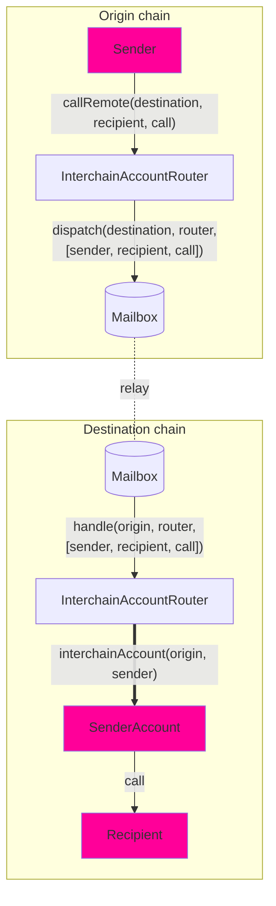

Interchain Accounts (ICAs) enable a contract on the origin chain to make authenticated calls to contracts on a remote chain. Unlike general message passing, which requires the recipient to implement a specific interface, ICAs allow interaction with _any_ contract on the destination chain.

Developers can use ICAs for cross-chain execution, enabling contracts to trigger function calls on remote chains.

Each ICA on a destination chain corresponds to a unique sender on the origin chain, and the account is deterministic based on `(origin, sender, router, ISM)`. This means that for every contract making interchain calls, there is a corresponding account on the destination chain that executes those calls.

<Note>ICA's are currently supported only on EVM chains.</Note>

## How Interchain Accounts Work

Interchain Accounts allow you to make a remote call from **Chain A** to **Chain B** using the router (`InterchainAccountRouter`).

We use [CREATE2](https://docs.openzeppelin.com/cli/2.8/deploying-with-create2) to compute the deterministic [OwnableMulticall](https://github.com/hyperlane-xyz/hyperlane-monorepo/blob/main/solidity/contracts/middleware/libs/OwnableMulticall.sol) contract address for you, which serves as a proxy for your cross-chain calls. You can explore this [here](./example-usage).

Here's how it works:

- You can encode your call which includes the to address, call data, and the `msg.value` for each call, batched together in an array.
- You send the encoded call to the **Chain A** router which gets relayed to the **Chain B** router.
- After decoding the calls, the **Chain B** router checks if the computed address is already deployed or not. If not, we deploy the _OwnableMulticall_ contract.
- The router then performs a multicall on the ICA address, which in turn makes the desired arbitrary call on **Chain B**.

The Interchain Account interface assigns every `(uint32 origin, address owner, address remoteRouter, address remoteISM)` tuple a unique ICA address. The sender owns that ICA on the destination chain, and can direct it to make arbitrary function calls via the `InterchainAccountRouter.callRemote()` endpoint.

For core chains supported by Hyperlane, you are able to use the defaults that are set by the owner of the router contract. See the [#overrides](./example-usage#overrides) section to see how to make calls to _any_ chain.

## Architecture Overview



## Interface

```solidity
// SPDX-License-Identifier: MIT OR Apache-2.0
pragma solidity >=0.6.11;

import {CallLib} from "../contracts/libs/Call.sol";

interface IInterchainAccountRouter {
    function callRemote(
        uint32 _destinationDomain,
        CallLib.Call[] calldata calls
    ) external returns (bytes32);

    function getRemoteInterchainAccount(uint32 _destination, address _owner)
        external
        view
        returns (address);
}
```

<Tip>
  - Use `InterchainAccountRouter` out of the box - ICA routers have already been
  deployed to core chains. Please refer to
  [addresses](/docs/reference/addresses/deployments/mainnet/interchainAccountRouter).
  Try using the `callRemote` method to do a call via your wallet's interchain
  account.
</Tip>
