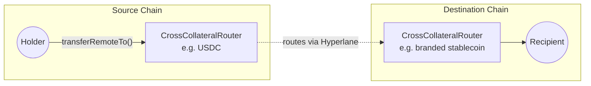

<Warning>
  Metastable is under active development. Interfaces, fees, and supported routes
  may change.
</Warning>

Metastable is a way to swap between like assets (most commonly stablecoins) across different chains in a single step. Any stablecoin — USDC, USDT, USDG, branded stables, or non-USD stables — can be enrolled.

For example: a USDC holder on Arbitrum wants a branded stablecoin on a new chain. With Metastable, that happens in one transaction. No manual bridging, no extra steps.

## The Problem It Solves

Launching a branded stablecoin is now easy. Getting stablecoin holders to actually use it is the hard part.

<Info>
  A **branded stablecoin** is a stable issued by a specific project, app, or
  chain — distinct from broad-market stables like USDC or USDT.
</Info>

Most stablecoin holders already keep their balances in USDC or USDT, spread across many chains. For a new branded stablecoin to grow, the issuing team has to meet those holders where their funds already are.

<CardGroup cols={2}>
  <Card title="Without Metastable" icon="circle-x">
    1. Bridge USDC to the destination chain
    2. Acquire gas on that chain
    3. Find a decentralized exchange (DEX) with the USDC ↔ branded pair
    4. Swap, often with high slippage

    Each step loses stablecoin holders.

  </Card>
  <Card title="With Metastable" icon="circle-check">
    Send USDC from any supported chain — receive the branded stablecoin on the destination chain. One transaction.

    No bridge. No DEX. No liquidity bootstrap. The system itself holds reserves of both tokens.

  </Card>
</CardGroup>

The same flow works in the other direction — holders won't enter a stablecoin they can't easily exit.

For the issuing team, this changes three things:

- **Less friction**: bridging, getting gas, and swapping on a DEX collapse into a single transaction, so fewer holders drop off along the way
- **Wider reach**: stablecoin holders can come from any supported chain, so growth does not depend on getting listed on a DEX on every chain
- **Flexible pricing**: fees are set per route, so the issuing team can charge on the way in, on the way out, on both, or set fees to zero to encourage adoption

## Use Cases

<CardGroup cols={1}>
  <Card title="Branded stablecoin issuers" icon="building-columns">
    Metastable handles conversions between the branded stable and broad-market
    stables like USDC and USDT.
  </Card>
  <Card title="Stablecoin payment apps" icon="credit-card">
    A payment app may accept deposits in one stable, hold balances in another,
    and send payments in a third. Metastable handles the conversions between
    them.
  </Card>
  <Card title="Multi-chain stablecoin operators" icon="network-wired">
    Adding support for a stablecoin on a new chain happens through route
    configuration, without a separate integration per chain.
  </Card>
</CardGroup>

## Key Capabilities

<CardGroup cols={2}>
  <Card title="Cross-chain & same-chain" icon="arrows-left-right">
    One transfer model handles both paths.
  </Card>
  <Card title="Per-route fees" icon="coins">
    Fees configured per route, per direction.
  </Card>
  <Card title="Native rebalancing" icon="scale-balanced">
    Inventory automatically balanced across chains to keep routes available.
  </Card>
  <Card title="Direct destination delivery" icon="bullseye">
    Conversions land on the destination chain directly — no intermediate-chain
    hops.
  </Card>
</CardGroup>

## Supported tokens

Metastable works with any standard ERC-20 token that can be enrolled in a route. In practice, this is most commonly stablecoins:

- **Broad-market stables** — USDC, USDT, USDG
- **Branded stablecoins** — issued by chains, apps, or platforms
- **Non-USD stablecoins** — supported on request

## How It Works

At a high level:

1. A stablecoin holder starts the swap on the source chain by sending USDC (or another supported collateral).
2. Metastable routes the funds to the destination chain.
3. The holder receives the target stablecoin on the destination chain.

The same flow works for same-chain swaps, for example USDC to a branded stablecoin on the same network.

Every swap can be tracked end-to-end in the [Hyperlane Explorer](https://explorer.hyperlane.xyz) — origin transaction, destination transaction, and the cross-chain message linking them.

## FAQ

<AccordionGroup>
  <Accordion title="What tokens are supported?">
    Any standard ERC-20 token can be enrolled in a route. In practice, this is
    most commonly stablecoins: broad-market stables (USDC, USDT, USDG), branded
    stablecoins, and non-USD stablecoins (on request).
  </Accordion>
  <Accordion title="How does adding a new chain work?">
    Each new chain gets its own deployed `CrossCollateralRouter` contracts (one
    per supported token). The same `transferRemoteTo` interface is used to route
    swaps to and from the new chain.
  </Accordion>
  <Accordion title="Who manages liquidity for a route?">
    Liquidity sits in the router contracts and is rebalanced automatically
    across chains. There is no external market maker, OTC desk, or rebalancing
    infrastructure to coordinate with.
  </Accordion>
  <Accordion title="Are fees configurable?">
    Yes — fees are set per route, per direction. Routes can charge on inbound
    swaps, outbound swaps, both, or be fee-free.
  </Accordion>
  <Accordion title="How do we get started?">
    Reach out to the [Abacus Works team](https://www.hyperlane.xyz/contact) to
    get started.
  </Accordion>
</AccordionGroup>

## More Resources

To dive deeper into how Metastable works under the hood, or learn about the underlying architecture:

<CardGroup cols={2}>
  <Card
    title="Metastable Technical Details"
    icon="gear"
    href="/docs/applications/metastable/technical-details"
  >
    Contract structure, swap flows, fee quoting, and rebalancing mechanics.
  </Card>
  <Card
    title="Hyperlane Warp Routes 2.0"
    icon="route"
    href="/docs/applications/warp-routes/multi-collateral-warp-routes"
  >
    Architecture overview and the model Metastable is built on.
  </Card>
  <Card
    title="Deploy HWR 2.0"
    icon="rocket"
    href="/docs/guides/warp-routes/evm/deploy-multi-collateral-warp-routes"
  >
    Walkthrough for deploying a multi-collateral route.
  </Card>
  <Card
    title="Native Rebalancing"
    icon="scale-balanced"
    href="/docs/guides/warp-routes/evm/multi-collateral-warp-routes-rebalancing"
  >
    How collateral stays balanced across chains automatically.
  </Card>
</CardGroup>
