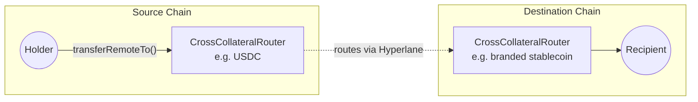

Metastable is an onchain clearing solution for stablecoins. It instantly converts one stablecoin into another across chains, in a single transaction. Send USDC on one chain, receive a different stablecoin on another, with no bridging, no DEX, and no slippage. Any stablecoin (USDC, USDT, or a branded stablecoin) can be enrolled.

_For example:_ a USDC holder on Arbitrum wants a branded stablecoin on a new chain. With Metastable, that happens in one transaction. No manual bridging, no extra steps.

## The problem it solves

Stablecoins are scattered across dozens of chains and dozens of forms. Getting the right one, on the right chain, is still slow and manual, both for the people holding them and the teams building on them.

<Info>
  A **branded stablecoin** is a stablecoin issued by a specific project, app, or
  chain, distinct from broad-market stablecoins like USDC or USDT.
</Info>

Take a branded stablecoin. Launching one is now easy, but getting holders to actually use it is the hard part. Most holders already keep their balances in USDC or USDT, which are spread across many chains. So to grow, a new stablecoin has to meet them where their funds already are.

The same flow works in the other direction. Holders won't enter a stablecoin they can't easily exit.

<CardGroup cols={2}>
  <Card title="Without Metastable" icon="circle-x">
    1. Bridge USDC to the destination chain
    2. Acquire gas on that chain
    3. Find a decentralized exchange (DEX) with the USDC ↔ branded stablecoin pair
    4. Swap, often with slippage and a rate below 1:1

    Each step loses stablecoin holders.

  </Card>
  <Card title="With Metastable" icon="circle-check">
    Send USDC from any supported chain, receive the branded stablecoin on the destination chain. One transaction.

    1:1 stablecoin conversions. No bridge, no DEX, no liquidity bootstrap. The system itself holds reserves of both tokens.

  </Card>
</CardGroup>

For teams building on stablecoins, this changes three things:

- **Less friction**: bridging, getting gas, and swapping on a DEX collapse into a single transaction, so fewer holders drop off along the way
- **Wider reach**: stablecoin holders can come from any supported chain, so growth does not depend on getting listed on a DEX on every chain
- **Flexible pricing**: fees are set per route, so the team can charge on the way in, on the way out, on both, or set fees to zero to encourage adoption. Fees can also be quoted off-chain, so the team can give chosen users a preferential rate such as 1:1

## Use cases

<CardGroup cols={1}>
  <Card title="Branded stablecoin issuers" icon="building-columns">
    Metastable handles conversions between the branded stablecoin and
    broad-market stablecoins like USDC and USDT.
  </Card>
  <Card title="Stablecoin payment apps" icon="credit-card">
    A payment app may accept deposits in one stablecoin, hold balances in
    another, and send payments in a third. Metastable handles the conversions
    between them.
  </Card>
  <Card title="Multi-chain stablecoin operators" icon="network-wired">
    Adding support for a stablecoin on a new chain happens through route
    configuration, without needing a separate integration per chain.
  </Card>
</CardGroup>

## Key capabilities

<CardGroup cols={2}>
  <Card title="Cross-chain & same-chain" icon="arrows-left-right">
    One transfer model handles both paths.
  </Card>
  <Card title="Per-route fees" icon="coins">
    Set fees per route and direction: charge on the way in, out, both, or not at
    all. Fees can also be quoted off-chain to give chosen users a lower or
    fee-free rate (1:1 conversion).
  </Card>
  <Card title="Automatic rebalancing" icon="scale-balanced">
    Add collateral to a route once, and the system keeps it balanced across
    chains automatically, with no active management needed.
  </Card>
  <Card title="Direct destination delivery" icon="bullseye">
    Conversions land on the destination chain directly, with no
    intermediate-chain hops.
  </Card>
</CardGroup>

## Supported tokens

Metastable works with any standard ERC-20 token that can be enrolled in a route. In practice, this is most commonly stablecoins:

- **Broad-market stablecoins**: USDC, USDT
- **Branded stablecoins**: issued by chains, apps, or platforms

## How it works

At a high level:

1. A stablecoin holder starts the swap on the source chain by sending USDC (or another supported collateral).
2. Metastable routes the funds to the destination chain.
3. The holder receives the target stablecoin on the destination chain.

The same flow works for same-chain swaps, for example USDC to a branded stablecoin on the same network.

Every swap can be tracked end-to-end in the [Hyperlane Explorer](https://explorer.hyperlane.xyz).

## FAQ

<AccordionGroup>
  <Accordion title="What tokens are supported?">
    Any standard ERC-20 token can be enrolled in a route. In practice, this is
    most commonly stablecoins: broad-market stablecoins (USDC, USDT) and branded
    stablecoins.
  </Accordion>
  <Accordion title="How does adding a new chain work?">
    Each new chain gets its own deployed `CrossCollateralRouter` contracts (one
    per supported token). The same `transferRemoteTo` interface is used to route
    swaps to and from the new chain.
  </Accordion>
  <Accordion title="Who manages liquidity for a route?">
    Liquidity sits in the router contracts and is rebalanced automatically
    across chains. There is no external market maker, OTC desk, or rebalancing
    infrastructure to coordinate with.
  </Accordion>
  <Accordion title="Are fees configurable?">
    Yes. Fees are set per route, per direction. Routes can charge on inbound
    swaps, outbound swaps, both, or be fee-free. Routes can also use off-chain
    signed quotes to give specific users a preferential rate such as 1:1, while
    everyone else pays the standard route fee.
  </Accordion>
  <Accordion title="How do I get started?">
    Reach out to the [Abacus Works team](https://www.hyperlane.xyz/contact) to
    get started.
  </Accordion>
</AccordionGroup>

## More resources

To dive deeper into how Metastable works under the hood, or learn about the underlying architecture:

<CardGroup cols={2}>
  <Card
    title="Metastable Technical Details"
    icon="gear"
    href="/docs/applications/metastable/technical-details"
  >
    Contract structure, swap flows, fee quoting, and rebalancing mechanics.
  </Card>
  <Card
    title="Hyperlane Warp Routes 2.0"
    icon="route"
    href="/docs/applications/warp-routes/multi-collateral-warp-routes"
  >
    Architecture overview and the model Metastable is built on.
  </Card>
  <Card
    title="Deploy HWR 2.0"
    icon="rocket"
    href="/docs/guides/warp-routes/evm/deploy-multi-collateral-warp-routes"
  >
    Walkthrough for deploying a multi-collateral route.
  </Card>
  <Card
    title="Native Rebalancing"
    icon="scale-balanced"
    href="/docs/guides/warp-routes/evm/multi-collateral-warp-routes-rebalancing"
  >
    How collateral stays balanced across chains automatically.
  </Card>
</CardGroup>
