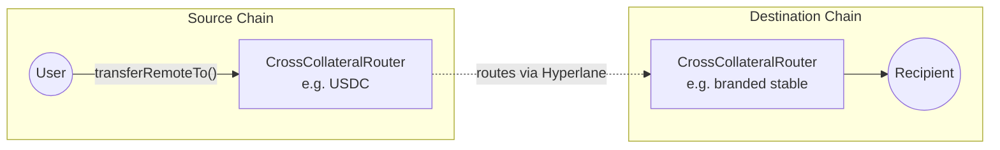

<Warning>
  StableLane is under active development. Interfaces, fees, and supported routes
  may change.
</Warning>

StableLane lets users move between like assets (most commonly stablecoins) across different chains in a single step.

For example: a user holds USDC on Arbitrum and wants a branded stablecoin on a new chain. With StableLane, that happens in one transaction. No manual bridging, no extra steps.

## The Problem It Solves

Launching a branded stablecoin is now easy. Getting users to actually use it is the hard part.

Most users already hold USDC or USDT, and those balances are spread across many chains. For a new branded stablecoin to grow, the issuer needs to make it simple for users to swap into it from wherever they already have funds.

Without something like StableLane, a user who wants to move from USDC into a new branded stablecoin has to:

1. Bridge USDC from their chain to the chain where the branded stablecoin is issued
2. Get gas on that destination chain
3. Find a DEX that supports the USDC ↔ branded stablecoin pair
4. Swap on that DEX, often at a bad price

Each step loses some users. Many give up before they finish.

Step 3 has an extra problem. A new stablecoin has no DEX liquidity until it has trading volume, and it cannot get trading volume until it has liquidity. To break this cycle, issuers usually pay for LP rewards, market maker deals, and DEX listings. This spending is expensive and does not directly bring in users. It only creates the conditions where users might come.

StableLane replaces all of this with a single transaction. The user sends USDC from any supported chain and receives the branded stablecoin on the destination chain. There is no bridge step, no DEX, and no need to bootstrap liquidity. The tokens held inside the routers _are_ the liquidity.

The same flow works in the other direction. This matters: if users cannot see a clear way out, they are less willing to come in. Making both directions simple removes a major reason people hesitate to try a new stablecoin.

For the issuer, this changes three things:

- **More users finish the swap**: one transaction instead of four means fewer people quit partway through
- **Wider reach**: users can come from any supported chain, so growth does not depend on getting listed on a DEX on every chain
- **Flexible pricing**: fees are set per route, so the issuer can charge on the way in, on the way out, on both, or set fees to zero to encourage adoption

## Key Capabilities

<CardGroup cols={3}>
  <Card title="Cross-chain & same-chain" icon="arrows-left-right">
    One transfer model handles both paths.
  </Card>
  <Card title="Per-route fees" icon="coins">
    Protocol and external fees configured per destination domain and target router.
  </Card>
  <Card title="Native rebalancing" icon="scale-balanced">
    Inventory automatically balanced across chains to keep routes available.
  </Card>
</CardGroup>

## How It Works

At a high level:

1. A user sends USDC (or another supported collateral) on the source chain.
2. StableLane routes it to the destination chain.
3. The user receives the target stablecoin on the destination chain.

The same flow works for same-chain swaps, for example USDC to a branded stable on the same network.



## Technical Details

StableLane is built on top of [Hyperlane Warp Routes 2.0](/docs/applications/warp-routes/multi-collateral-warp-routes).

Each chain in a StableLane route has a **`CrossCollateralRouter`** deployed for each collateral token (e.g. one for USDC, one for the branded stable). `CrossCollateralRouter` extends `HypERC20Collateral`, so each instance holds collateral for exactly one ERC20.

Every router maintains an owner-managed allowlist of trusted peer `CrossCollateralRouter`s across domains — a router can be enrolled per remote domain (the standard primary remote router) and additional routers can be enrolled per domain via the `CrossCollateral` allowlist. This trusted-router graph defines which source/destination pairs are valid for a given route.

<Note>
  **Token support:** standard ERC20s only. Rebasing tokens, fee-on-transfer tokens, and ERC777 are not supported — the contract relies on exact-amount accounting.
</Note>

### Cross-chain swap flow

<Steps>
  <Step title="User calls transferRemoteTo">
    On the source chain router, with the destination domain, recipient, amount, and target router address.
  </Step>
  <Step title="Source router validates and dispatches">
    Validates that the target router is enrolled, deducts configured fees, and dispatches a single interchain message via Hyperlane.
  </Step>
  <Step title="Destination router releases tokens">
    Receives the message, verifies the sender is a trusted router, and releases the target stablecoin to the recipient.
  </Step>
</Steps>

Routers expose a `transferRemoteTo` function used for both cross-chain and same-chain swaps:

```solidity
transferRemoteTo(
    uint32 destination,    // destination domain ID
    bytes32 recipient,     // recipient address on destination
    uint256 amount,        // amount of source token
    bytes32 targetRouter   // enrolled CrossCollateralRouter on destination
)
```

**Same-chain swaps** use the same interface with the local domain as the destination. In this path the source router skips mailbox dispatch and calls the target router's `handle` directly — there's no interchain relay and no gas payment.

### Fee quoting

Fees are configured per destination domain and per target router. Before executing a swap, integrators can call `quoteTransferRemoteTo` on the source router to get the exact cost for a route:

```solidity
quoteTransferRemoteTo(
    uint32 destination,
    bytes32 recipient,
    uint256 amount,
    bytes32 targetRouter
)
```

The returned quote covers interchain gas, the token amount plus protocol fee, and any external fee component. For same-chain swaps the gas portion is zero.

### Rebalancing

As swap volume flows in one direction, a router can run low on the collateral it holds. The HWR 2.0 rebalancer monitors inventory levels and moves collateral to restore target weights, keeping routes available without manual intervention.

<Note>
  **Why rebalancing is different in StableLane:** In a same-asset multi-collateral route, restoring balance is straightforward — the rebalancer moves the same token between chains. StableLane routes hold *different* assets on each side, so an imbalance often can't be fixed by moving the source token: the scarce asset has to be sourced directly (e.g. acquiring more of the branded stable on a chain where it's been drawn down). That extra step relies on external liquidity and carries real cost beyond the cross-chain transfer itself. The mechanics stay automatic; the operating economics are what change.
</Note>

See [Native Rebalancing](/docs/guides/warp-routes/evm/multi-collateral-warp-routes-rebalancing) for details.

## Get Started

To learn more about the underlying architecture or explore what a route deployment looks like:

<CardGroup cols={3}>
  <Card title="Hyperlane Warp Routes 2.0" icon="route" href="/docs/applications/warp-routes/multi-collateral-warp-routes">
    Architecture overview and the model StableLane is built on.
  </Card>
  <Card title="Deploy HWR 2.0" icon="rocket" href="/docs/guides/warp-routes/evm/deploy-multi-collateral-warp-routes">
    Walkthrough for deploying a multi-collateral route.
  </Card>
  <Card title="Native Rebalancing" icon="scale-balanced" href="/docs/guides/warp-routes/evm/multi-collateral-warp-routes-rebalancing">
    How collateral stays balanced across chains automatically.
  </Card>
</CardGroup>
