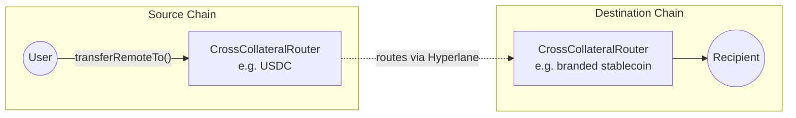

<Warning>
  StableLane is under active development. Interfaces, fees, and supported routes
  may change.
</Warning>

StableLane lets users move between like assets (most commonly stablecoins) across different chains in a single step.

For example: a user holds USDC on Arbitrum and wants a branded stablecoin on a new chain. With StableLane, that happens in one transaction. No manual bridging, no extra steps.

## The Problem It Solves

Launching a branded stablecoin is now easy. Getting users to actually use it is the hard part.

Most users already hold USDC or USDT across many chains. For a new branded stablecoin to grow, the issuer has to meet users where they already have funds.

<CardGroup cols={2}>
  <Card title="Without StableLane" icon="circle-x">
    1. Bridge USDC to the destination chain
    2. Acquire gas on that chain
    3. Find a DEX with the USDC ↔ branded pair
    4. Swap, often at a bad price

    Each step loses users.
  </Card>
  <Card title="With StableLane" icon="circle-check">
    User sends USDC from any supported chain → receives the branded stablecoin on the destination chain.

    No bridge. No DEX. No liquidity bootstrap. The routers _are_ the liquidity.
  </Card>
</CardGroup>

The same flow works in the other direction. If users cannot see a clear way out, they are less willing to come in. Making both directions simple removes a major reason people hesitate to try a new stablecoin.

For the issuer, this changes three things:

- **More users finish the swap**: one transaction instead of four means fewer people quit partway through
- **Wider reach**: users can come from any supported chain, so growth does not depend on getting listed on a DEX on every chain
- **Flexible pricing**: fees are set per route, so the issuer can charge on the way in, on the way out, on both, or set fees to zero to encourage adoption

## Key Capabilities

<CardGroup cols={3}>
  <Card title="Cross-chain & same-chain" icon="arrows-left-right">
    One transfer model handles both paths.
  </Card>
  <Card title="Per-route fees" icon="coins">
    Protocol and external fees configured per destination domain and target router.
  </Card>
  <Card title="Native rebalancing" icon="scale-balanced">
    Inventory automatically balanced across chains to keep routes available.
  </Card>
</CardGroup>

## How It Works

At a high level:

1. A user sends USDC (or another supported collateral) on the source chain.
2. StableLane routes it to the destination chain.
3. The user receives the target stablecoin on the destination chain.

The same flow works for same-chain swaps, for example USDC to a branded stable on the same network.



## Technical Details

StableLane is built on top of [Hyperlane Warp Routes 2.0](/docs/applications/warp-routes/multi-collateral-warp-routes).

Each chain in a StableLane route has a [**`CrossCollateralRouter`**](https://github.com/hyperlane-xyz/hyperlane-monorepo/blob/main/solidity/contracts/token/CrossCollateralRouter.sol) deployed for each collateral token (e.g. one for USDC, one for the branded stable). `CrossCollateralRouter` extends `HypERC20Collateral`, so each instance holds collateral for exactly one ERC20.

Every router maintains an owner-managed allowlist of trusted peer `CrossCollateralRouter`s per domain. The owner manages this allowlist with [`enrollCrossCollateralRouters`](https://github.com/hyperlane-xyz/hyperlane-monorepo/blob/main/solidity/contracts/token/CrossCollateralRouter.sol#L85) and [`unenrollCrossCollateralRouters`](https://github.com/hyperlane-xyz/hyperlane-monorepo/blob/main/solidity/contracts/token/CrossCollateralRouter.sol#L98), which write to the `_crossCollateralRouters` mapping (domain → set of router addresses). A single primary remote router can also be enrolled per domain through the standard `Router` enrollment. Together these define which source/destination pairs are valid for a given route, and allow multiple target routers on the same destination chain (for example, several branded stablecoins).

<Note>
  **Token support:** standard ERC20s only. Rebasing tokens, fee-on-transfer tokens, and ERC777 are not supported — the contract relies on exact-amount accounting.
</Note>

### Cross-chain swap flow

1. User calls [`transferRemoteTo`](https://github.com/hyperlane-xyz/hyperlane-monorepo/blob/main/solidity/contracts/token/CrossCollateralRouter.sol#L327) on the source chain router with the destination domain, recipient, amount, and target router.
2. The source router validates that the target router is enrolled, pulls `amount + protocol fee + external fee` from the user, sends the fees to their respective recipients, and dispatches a single interchain message via Hyperlane.
3. The destination router receives the message, verifies the sender is a trusted router, and releases the full `amount` of the target stablecoin to the recipient.

Routers expose a `transferRemoteTo` function used for both cross-chain and same-chain swaps:

```solidity
transferRemoteTo(
    uint32 destination,    // destination domain ID
    bytes32 recipient,     // recipient address on destination
    uint256 amount,        // amount of source token
    bytes32 targetRouter   // enrolled CrossCollateralRouter on destination
) public payable returns (bytes32 messageId)
```

The returned `messageId` is the Hyperlane message ID used to track delivery (for example, in the Hyperlane Explorer). For same-chain swaps, where no message is dispatched, the return value is the zero hash.

**Same-chain swaps** use the same interface with the local domain as the destination. In this path the source router skips mailbox dispatch and calls the target router's [`handle`](https://github.com/hyperlane-xyz/hyperlane-monorepo/blob/main/solidity/contracts/token/CrossCollateralRouter.sol#L180) directly — there's no interchain relay and no gas payment. To make this possible, `CrossCollateralRouter` overrides `handle` to drop the standard `onlyMailbox` modifier: when the caller is the mailbox, the origin must be a different domain; when the caller is another local contract, it must be a `CrossCollateralRouter` enrolled in this router's local-domain allowlist.

### Fee quoting

Fees are configured per destination domain and per target router. Before executing a swap, integrators can call [`quoteTransferRemoteTo`](https://github.com/hyperlane-xyz/hyperlane-monorepo/blob/main/solidity/contracts/token/CrossCollateralRouter.sol#L394) on the source router to get the exact cost for a route:

```solidity
quoteTransferRemoteTo(
    uint32 destination,
    bytes32 recipient,
    uint256 amount,
    bytes32 targetRouter
) public view returns (Quote[] memory quotes)
```

Each `Quote` is `{ address token, uint256 amount }`. The function returns an array of **three** entries, in this order:

1. **Interchain gas** — paid in `feeToken()`. Zero for same-chain swaps.
2. **Token amount + protocol fee** — the source token amount the user is transferring, plus the protocol fee.
3. **External fee** — additional fee in the source token. Zero when no external fee is configured for the route.

The user transfers entries 2 and 3 from their source-token balance; sum them to display the total source-token cost. Entry 1 is paid separately in `feeToken()` for interchain gas. The recipient on the destination chain receives the original `amount` of the target token.

### Rebalancing

As swap volume flows in one direction, a router can run low on the collateral it holds. The HWR 2.0 rebalancer monitors inventory levels and moves collateral to restore target weights, keeping routes available without manual intervention.

<Note>
  **Why rebalancing is different in StableLane:** In a same-asset multi-collateral route, restoring balance is straightforward — the rebalancer moves the same token between chains. StableLane routes hold *different* assets on each side, so an imbalance often can't be fixed by moving the source token: the scarce asset has to be sourced directly (e.g. acquiring more of the branded stable on a chain where it's been drawn down). That extra step relies on external liquidity and carries real cost beyond the cross-chain transfer itself. The mechanics stay automatic; the operating economics are what change.
</Note>

## More Resources

To learn more about the underlying architecture or explore what a route deployment looks like:

<CardGroup cols={3}>
  <Card title="Hyperlane Warp Routes 2.0" icon="route" href="/docs/applications/warp-routes/multi-collateral-warp-routes">
    Architecture overview and the model StableLane is built on.
  </Card>
  <Card title="Deploy HWR 2.0" icon="rocket" href="/docs/guides/warp-routes/evm/deploy-multi-collateral-warp-routes">
    Walkthrough for deploying a multi-collateral route.
  </Card>
  <Card title="Native Rebalancing" icon="scale-balanced" href="/docs/guides/warp-routes/evm/multi-collateral-warp-routes-rebalancing">
    How collateral stays balanced across chains automatically.
  </Card>
</CardGroup>
