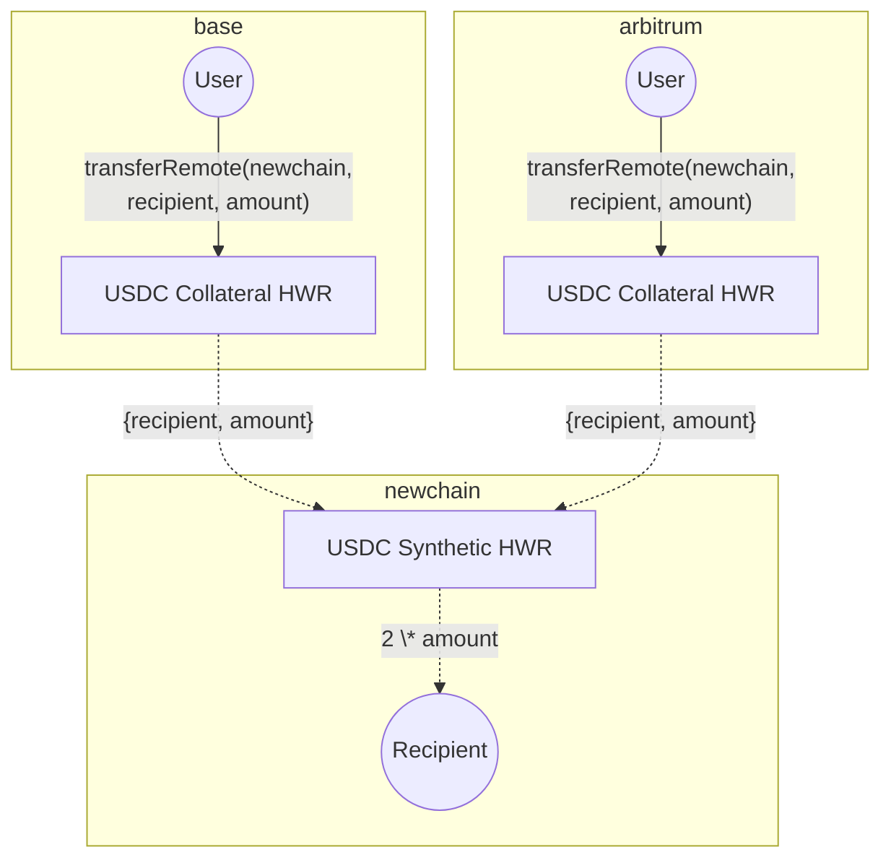

Hyperlane Warp Routes 2.0 are a type of Hyperlane Warp Route (HWR) that allows liquidity to be sourced from multiple collateral chains.

## Overview

In a single-collateral HWR, tokens are locked on one source chain.

Example:

- Lock 100 USDC on Ethereum
- Mint 100 USDC on NewChain

Hyperlane Warp Routes 2.0, on the other hand, allows users to bridge from multiple collateral chains.

Example:

- Lock 50 USDC on Base
- Lock 50 USDC on Arbitrum
- Mint 100 USDC on NewChain

This setup allows a destination chain to receive assets from multiple sources, making it easier for users to onboard liquidity without depending on a single origin.

## High-level Flowchart

<Warning>
  Since liquidity can come from multiple sources, balancing collateral across
  chains is important to ensure a smooth user experience. Currently, teams must
  rebalance manually. Automated solutions aim to streamline this.
</Warning>

## Guides

- To deploy Hyperlane Warp Routes 2.0 head over to [Deploy a Hyperlane Warp Route 2.0](/docs/guides/warp-routes/evm/deploy-multi-collateral-warp-routes)
