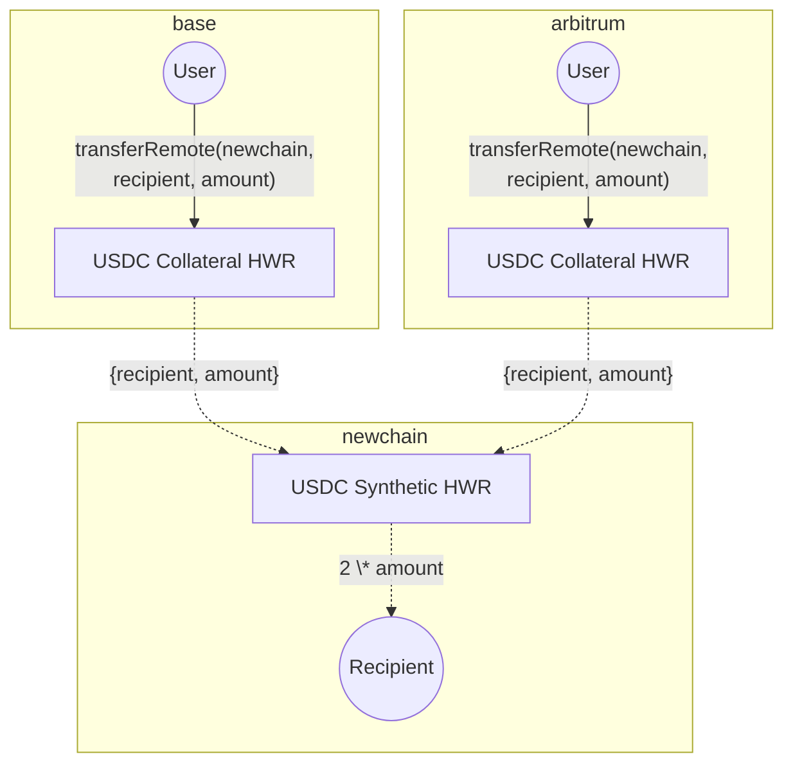

Hyperlane Warp Routes 2.0 are a type of Hyperlane Warp Route (HWR) that allows liquidity to be sourced from multiple collateral chains with native rebalancing for supported configurations.

## Overview

In a single-collateral HWR, tokens are locked on one source chain.

Example:

- Lock 100 USDC on Ethereum
- Mint 100 USDC on NewChain

Hyperlane Warp Routes 2.0, on the other hand, allows users to bridge from multiple collateral chains.

Example:

- Lock 50 USDC on Base
- Lock 50 USDC on Arbitrum
- Mint 100 USDC on NewChain

This setup allows a destination chain to receive assets from multiple sources, making it easier for users to onboard liquidity without depending on a single origin.

## Native Rebalancing

If more funds flow in one direction, one of the chains in the route can run out of collateral, creating imbalanced flow that prevents withdrawals. To maintain a smooth user experience, collateral must be balanced across chains. HWR 2.0 addresses this with native rebalancing - collateral is automatically moved between chains to resolve imbalances via the rebalancer.

To learn more about Native Rebalancing, head over to: [HWR 2.0 : Native Rebalancing](/docs/guides/warp-routes/evm/multi-collateral-warp-routes-rebalancing)

## High-level Flowchart

## Supported Tokens and Protocols

Native rebalancing is possible when the required conditions are met for a given token on each participating chain in the HWR 2.0.

### USDC

- **Chains**: Arbitrum, Base, Optimism, etc.
  - Support for additional chains which are supported by [Circle CCTP](https://developers.circle.com/cctp) v1/v2 will roll out incrementally.

### ETH
- **Chains**: Support rolling out incrementally based on Everclear deployment

### USDT

- 🚧 Native rebalancing support is currently planned

<Note>
Chain support for native rebalancing depends on protocol availability and token bridging infrastructure. Read more about the [requirements for native rebalancing](/docs/guides/warp-routes/evm/multi-collateral-warp-routes-rebalancing#requirements-for-native-rebalancing)
</Note>

## Guides

- To deploy Hyperlane Warp Routes 2.0 head over to [Deploy a Hyperlane Warp Route 2.0](/docs/guides/warp-routes/evm/deploy-multi-collateral-warp-routes)
