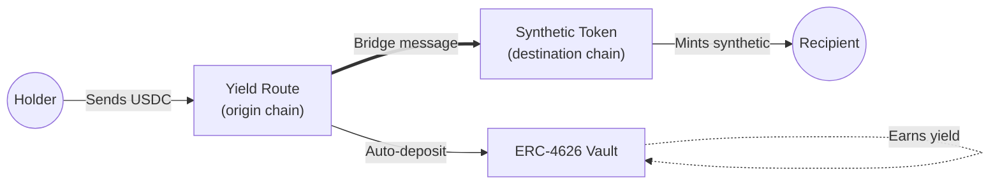
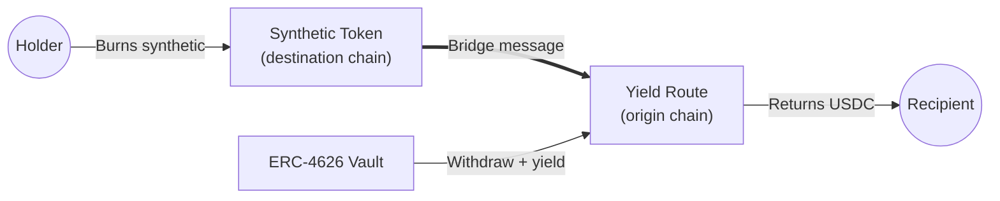

A **yield route** is a [Hyperlane Warp Route](/docs/applications/warp-routes/overview) variant that puts bridged collateral to work. While the assets sit locked on the origin chain, they are deposited into an [ERC-4626 vault](https://ethereum.org/en/developers/docs/standards/tokens/erc-4626/) that earns yield — any vault that implements the standard can be used without modification.

<Note>
  **ERC-4626** is the Ethereum standard for tokenized yield-bearing vaults. When
  you deposit assets, the vault generates yield through some underlying strategy
  (lending, staking, real-world assets, etc.), and you receive share tokens
  representing your stake.
</Note>

## Why Yield Routes

Bridged assets typically sit locked in a collateral contract on the origin chain. A yield route deposits that collateral into an ERC-4626 vault — such as one provided by Aave or Morpho — so it earns yield while the bridge experience for the holder stays the same.

<CardGroup cols={1}>
  <Card title="Put bridged assets to work" icon="chart-line">
    A yield route turns idle bridged collateral into a yield-earning position.
    The deployer — a chain team, an app, a protocol — captures yield on assets
    that would otherwise be unproductive.
  </Card>
  <Card title="A new distribution channel" icon="share-nodes">
    Yield routes create an automatic deposit channel for ERC-4626 vaults:

    - **Bridge users** become depositors without having to discover the vault.
    - **Vault providers** gain reach without traditional integration work.
    - **Route deployers** gain a yield-bearing bridge without building any vault themselves.

  </Card>
  <Card title="Embedded yield for apps" icon="puzzle-piece">
    A consumer app or fintech can offer yield-bearing deposits without building
    any vault infrastructure. The app sits on a chain with a yield route pointed
    at an ERC-4626 vault; the vault provider handles the yield generation.
  </Card>
</CardGroup>

## How It Works

### Components

Each yield route has two core contracts:

| Chain           | Contract                                                                                                                                                                                                                                                                                                               | What it does                                                                                                        |
| --------------- | ---------------------------------------------------------------------------------------------------------------------------------------------------------------------------------------------------------------------------------------------------------------------------------------------------------------------- | ------------------------------------------------------------------------------------------------------------------- |
| **Origin**      | [`HypERC4626OwnerCollateral`](https://github.com/hyperlane-xyz/hyperlane-monorepo/blob/main/solidity/contracts/token/extensions/HypERC4626OwnerCollateral.sol) or [`HypERC4626Collateral`](https://github.com/hyperlane-xyz/hyperlane-monorepo/blob/main/solidity/contracts/token/extensions/HypERC4626Collateral.sol) | Accepts the deposited collateral and forwards it into an ERC-4626 vault. The vault generates yield.                 |
| **Destination** | [`HypERC20`](https://github.com/hyperlane-xyz/hyperlane-monorepo/blob/main/solidity/contracts/token/HypERC20.sol) or [`HypERC4626`](https://github.com/hyperlane-xyz/hyperlane-monorepo/blob/main/solidity/contracts/token/extensions/HypERC4626.sol)                                                                  | Mints a synthetic representation of the deposited collateral. Holders on the destination chain hold this synthetic. |

Depending on the type of route, yield is distributed to different parties. The two standard types are **owner-yield** (`HypERC4626OwnerCollateral`), where yield goes to the route owner (the team that deploys and operates the route), and **user-yield** (`HypERC4626Collateral`), where yield goes back to the holders of the synthetic token.

### Example flow

Below is the conceptual flow for bridging in and out of a yield route. For the detailed walkthrough, see the [Deploy Yield Routes](/docs/guides/warp-routes/evm/deploy-yield-routes) guide.

**Bridge in: collateral → vault, synthetic minted**

1. The holder sends collateral (e.g. USDC) to the yield route on the origin chain.
2. The yield route deposits the collateral into an ERC-4626 vault, where it earns yield.
3. The yield route dispatches a bridge message via Hyperlane to the destination chain.
4. The synthetic token contract on the destination chain mints the synthetic to the recipient.

**Bridge out: synthetic burned, vault → collateral**

1. The holder burns the synthetic on the destination chain.
2. The destination synthetic contract dispatches a bridge message back to the origin chain.
3. The yield route on the origin chain withdraws the collateral from the vault.
4. The yield route returns the collateral to the recipient.

## Vault Integration

The route deployer specifies the vault address at deploy time. From then on, the yield route calls the standard ERC-4626 methods (`deposit`, `withdraw`, `previewDeposit`, `convertToAssets`, `convertToShares`) on the vault. The vault itself does not need any Hyperlane-specific implementation.

See the [Vault compatibility requirements](/docs/guides/warp-routes/evm/deploy-yield-routes#pre-requisites) in the deploy guide for the specific vault requirements.

## Deploy a Yield Route

<Card
  title="Deploy Yield Routes"
  icon="rocket"
  href="/docs/guides/warp-routes/evm/deploy-yield-routes"
>
  Step-by-step walkthrough using the Hyperlane CLI.
</Card>
