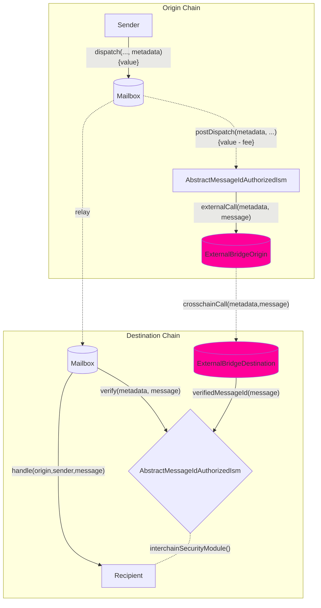

Hooks and ISMs have a complementary relationship: you can customize your behavior from origin and they use a pairwise ISM contract on the destination to verify your custom hook behavior.

You can implement and utilize your own hook and ISM pattern as per your requirements. You can use an external bridge provider like Wormhole or Chainlink's CCIP by implementing the `IPostDispatchHook` interface on the source chain and `IInterchainSecurityModule` on the destination chain.

<AccordionGroup>
  <Accordion title="IPostDispatchHook Interface">
    ```solidity
        interface IPostDispatchHook {
          enum Types {
              UNUSED,
              ROUTING,
              AGGREGATION,
              MERKLE_TREE,
              INTERCHAIN_GAS_PAYMASTER,
              FALLBACK_ROUTING,
              ID_AUTH_ISM,
              PAUSABLE,
              PROTOCOL_FEE,
              LAYER_ZERO_V1,
              RATE_LIMITED,
              ARB_L2_TO_L1,
              OP_L2_TO_L1,
              MAILBOX_DEFAULT_HOOK,
              AMOUNT_ROUTING
          }

          /**
          * @notice Returns an enum that represents the type of hook
          */
          function hookType() external view returns (uint8);

          /**
          * @notice Returns whether the hook supports metadata
          * @param metadata metadata
          * @return Whether the hook supports metadata
          */
          function supportsMetadata(
              bytes calldata metadata
          ) external view returns (bool);

          /**
          * @notice Post action after a message is dispatched via the Mailbox
          * @param metadata The metadata required for the hook
          * @param message The message passed from the Mailbox.dispatch() call
          */
          function postDispatch(
              bytes calldata metadata,
              bytes calldata message
          ) external payable;

          /**
          * @notice Compute the payment required by the postDispatch call
          * @param metadata The metadata required for the hook
          * @param message The message passed from the Mailbox.dispatch() call
          * @return Quoted payment for the postDispatch call
          */
          function quoteDispatch(
              bytes calldata metadata,
              bytes calldata message
          ) external view returns (uint256);
        }
    ```

  </Accordion>

  <Accordion title="IInterchainSecurityModule Interface">
    ```solidity
    // SPDX-License-Identifier: MIT OR Apache-2.0
    pragma solidity >=0.6.11;

    interface IInterchainSecurityModule {
    enum Types {
    UNUSED,
    ROUTING,
    AGGREGATION,
    LEGACY_MULTISIG,
    MERKLE_ROOT_MULTISIG,
    MESSAGE_ID_MULTISIG,
    NULL, // used with relayer carrying no metadata
    CCIP_READ,
    ARB_L2_TO_L1,
    WEIGHTED_MERKLE_ROOT_MULTISIG,
    WEIGHTED_MESSAGE_ID_MULTISIG,
    OP_L2_TO_L1
    }

        /**
        * @notice Returns an enum that represents the type of security model
        * encoded by this ISM.
        * @dev Relayers infer how to fetch and format metadata.
        */
        function moduleType() external view returns (uint8);

        /**
        * @notice Defines a security model responsible for verifying interchain
        * messages based on the provided metadata.
        * @param _metadata Off-chain metadata provided by a relayer, specific to
        * the security model encoded by the module (e.g. validator signatures)
        * @param _message Hyperlane encoded interchain message
        * @return True if the message was verified
        */
        function verify(
            bytes calldata _metadata,
            bytes calldata _message
        ) external returns (bool);

    }

    interface ISpecifiesInterchainSecurityModule {
    function interchainSecurityModule()
    external
    view
    returns (IInterchainSecurityModule);
    }
    ```

  </Accordion>
</AccordionGroup>

<Note>
  Hooks currently expect metadata to be formatted with the
  [`StandardHookMetadata`
  library](/docs/reference/developer-tools/libraries/hookmetadata).
</Note>

You can also inherit from our `AbstractMessageIdAuthorizedIsm` which allows for access control for an intermediate `verifyMessageId` function call which sets in storage the messageId to true if received from the authorized `AbstractMessageIdAuthHook` hook. This pattern is used currently in the [`OpStackHook`](https://github.com/hyperlane-xyz/hyperlane-monorepo/blob/ef2ece300e71a30e8f4f59e5b26e21eea012d43b/solidity/contracts/hooks/OPStackHook.sol#L33C8-L33C8) \<> [`OpStackIsm`](https://github.com/hyperlane-xyz/hyperlane-monorepo/blob/ef2ece300e71a30e8f4f59e5b26e21eea012d43b/solidity/contracts/isms/hook/OPStackIsm.sol#L31) pattern.

## Workflow



## Interface

After implementing the above interfaces, you can override default hook along the hook metadata by using the overloaded `dispatch` call in our mailbox.
**On the source chain:**

- `mailbox.dispatch()` calls your custom hook via `AbstractMessageIdAuthHook.postDispatch()`.
- `_postDispatch` checks whether `latestDispatchedId` is the id being dispatched from the hook to make the mailbox is the contract calling the hook (since calling `postDispatch` isn't access controlled)
- `_sendMessageId` calls your custom external bridge logic like calling the CCIP router contract.

**On the destination chain:**

- The external bridge will call `verifyMessageId` function (which is access-controlled) and sets the `messageId` in the `verifiedMessages` mapping to true.
- On receiving the message for the relayer, the mailbox will call your ISM contract (specified in your recipient address) which checks if the messageId in the `verifiedMessages` mapping is true and returns true to the mailbox and vice versa.

<Warning>
  `AbstractMessageIdAuthorizedIsm` can send `msg.value` through `postDispatch`
  calls and we utilize the `verifiedMessages`' little endian 255 bits for
  storing the `msg.value` and the top bit for the actual receipt of the
  messageId delivery. Therefore, you can send up to 2^255 amount of value of the
  native token from origin and the destination ISM can only receive 2^255 amount
  of value of native token on the destination chain.
</Warning>

## Access Control

If `postDispatch` must only be called with a `message` that was _just_ dispatched, the `latestDispatchedId` function on the Mailbox can be used to verify the message was _actually_ dispatched.

<Note>
  This is used instead of some `require(mailbox == msg.sender)` to support
  **composition** where a hook may pass a `message` along to another hook.
</Note>

The following utility is provided in the [`MailboxClient` library](/docs/reference/developer-tools/libraries/mailbox-client) for convenience.
