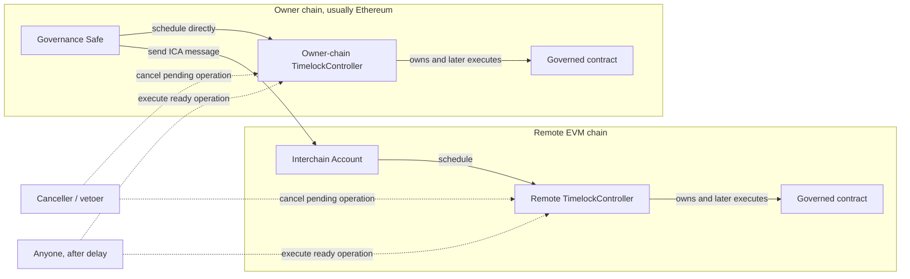

Hyperlane contracts are commonly `Ownable` because teams need a way to expand to new chains, enroll routers, update ISMs, change Hooks, tune rate limits, pause routes, or transfer ownership. For production systems, direct ownership by a hot key or even a multisig can still be risky: if the owner path is compromised, an attacker can execute privileged changes immediately.

A governance timelock puts a delay between proposing an owner action and executing it. This gives your team, integrators, and monitors time to inspect the action and cancel it before it takes effect.

## Who should use this

Use timelock governance if you operate:

- A Warp Route with meaningful TVL.
- A chain's Hyperlane Mailbox or core deployment.
- A route integrated by external protocols, lending markets, or risk teams.
- A multisig or ICA setup where signers are not expected to make urgent owner changes.

Timelocks are especially useful when governance actions are important but rarely time-sensitive.

## How OpenZeppelin timelocks work

Hyperlane tooling uses OpenZeppelin's [`TimelockController`](https://github.com/OpenZeppelin/openzeppelin-contracts/blob/v4.7.0/contracts/governance/TimelockController.sol), exposed through Hyperlane's [`TimelockController` wrapper](https://github.com/hyperlane-xyz/hyperlane-monorepo/blob/main/solidity/contracts/upgrade/TimelockController.sol). The timelock contract becomes the owner of the governed contract.

An owner action then has two phases:

1. A proposer schedules the exact call on the timelock.
2. After `minDelay`, anyone with executor rights can execute that exact call.

The operation includes the target contract, calldata, ETH value, predecessor, salt, and delay. The timelock hashes these fields into an operation ID, so the executed transaction must match what was scheduled.

## Roles

| Role | What it can do | Recommended setup |
|---|---|---|
| `PROPOSER_ROLE` | Schedule operations | Governance Safe on the owner chain, or its ICA on remote chains |
| `EXECUTOR_ROLE` | Execute ready operations | `address(0)` for permissionless execution |
| `CANCELLER_ROLE` | Cancel pending operations | Operational vetoer, deployer key, security council, or governance-controlled address |
| `TIMELOCK_ADMIN_ROLE` | Manage roles | Use carefully; avoid leaving this on a hot deployer key |

Permissionless execution is usually desirable. Once a valid proposal has waited through the delay, anyone can execute it, so liveness does not depend on the proposer returning online.

In the OpenZeppelin v4.7 implementation used by Hyperlane, initial proposers also receive `CANCELLER_ROLE`. Account for that when choosing proposers and vetoers.

## Why it is safer

Without a timelock, a compromised owner can immediately change sensitive configuration. For a Warp Route, that could mean replacing the ISM, changing ownership, altering limits, or weakening safety controls.

With a timelock:

- The malicious or mistaken action is visible before execution.
- Watchers can decode and review the scheduled calldata.
- A configured canceller can veto the operation.
- Integrators get time to react before the change takes effect.
- ICA-based governance is less brittle because a bad ICA message can schedule an action, but cannot execute it immediately.

Timelocks do not replace good key management, good ISM design, or monitoring. They add an observation and cancellation window around owner actions.

## Hyperlane setup

A typical setup starts with one governance Safe on an owner chain, usually Ethereum. For contracts on that same chain, the Safe can govern directly. For contracts on remote chains, the Safe uses an [Interchain Account (ICA)](/docs/applications/interchain-account) to make authenticated calls on the remote chain.

Timelocks are then added as the owner of each governed contract. The Safe or ICA does not execute owner actions immediately. Instead, it proposes actions to the timelock, and the timelock enforces the delay and cancellation window before execution.



There are three pieces in the governance path:

- Same-chain multisig governance: the owner-chain Safe is the source of governance decisions.
- ICA-based remote governance: the Safe controls remote-chain ICAs so it can govern contracts on other chains from the owner chain.
- Timelock-controlled ownership: each governed contract is owned by its local timelock, which delays execution and allows cancellation.

For same-chain governance:

- The governed contract is owned by the timelock on that same chain.
- The governance Safe has `PROPOSER_ROLE` on that timelock.
- The Safe schedules actions directly on the timelock.

For remote-chain governance:

- The governed contract is owned by a timelock on that remote chain.
- The proposer is an ICA on that remote chain.
- That ICA is controlled by the governance Safe on the owner chain.
- The Safe sends an ICA message, and the ICA schedules the action on the remote timelock.

The flow for a remote owner action is:

1. The owner-chain Safe creates an ICA transaction.
2. The ICA schedules the action on the remote chain's timelock.
3. The action waits for the configured delay. Hyperlane recommends at least 1 day as a production baseline.
4. If the proposal is bad, a canceller calls `cancel`.
5. If the proposal is valid, anyone executes the queued operation after the delay.

For Ethereum-local actions, the Safe can schedule directly on the Ethereum timelock without using an ICA.

## Example

Suppose a Warp Route on Base is owned by a Base timelock. The timelock has:

- `PROPOSER_ROLE`: the Ethereum Safe's ICA on Base.
- `EXECUTOR_ROLE`: `address(0)`.
- `CANCELLER_ROLE`: an operational vetoer or security council address.
- `minDelay`: at least `86400` seconds, matching Hyperlane's 1-day production baseline.

To update the route ISM, the Ethereum Safe does not call the route directly. It sends an ICA call that schedules the route's `setInterchainSecurityModule(newIsm)` call on the Base timelock. The call can only be executed after the delay, and only if it has not been cancelled.

## Submitter strategy

When you deploy or update your own Warp Route with the Hyperlane CLI, pass a submitter strategy so the CLI knows how to submit owner transactions. If your route is owned by a timelock, use a `timelockController` submitter strategy.

The strategy wraps route updates in `scheduleBatch` and returns the later `executeBatch` transaction. This lets `warp apply` propose the update through the timelock instead of trying to call the owned contract directly.

The type names below match the current SDK submitter types: [`timelockController`, `interchainAccount`, and `gnosisSafeTxBuilder`](https://github.com/hyperlane-xyz/hyperlane-monorepo/blob/main/typescript/sdk/src/providers/transactions/submitter/TxSubmitterTypes.ts). The `timelockAddress` and `proposerSubmitter` keys come from the [EVM timelock submitter schema](https://github.com/hyperlane-xyz/hyperlane-monorepo/blob/main/typescript/sdk/src/providers/transactions/submitter/ethersV5/types.ts), and the `internalSubmitter` nesting with Safe Tx Builder `version: '1.0'` matches the current [oUSDT strategy config](https://github.com/hyperlane-xyz/hyperlane-monorepo/blob/main/typescript/infra/config/environments/mainnet3/warp/strategies/ousdt.yaml).

Example remote-chain strategy:

```yaml
base:
  submitter:
    type: timelockController
    chain: base
    timelockAddress: "0x..."
    proposerSubmitter:
      type: interchainAccount
      chain: ethereum
      destinationChain: base
      owner: "0x..." # Ethereum Safe
      internalSubmitter:
        type: gnosisSafeTxBuilder
        chain: ethereum
        safeAddress: "0x..."
        version: "1.0"
```

Example owner-chain strategy:

```yaml
ethereum:
  submitter:
    type: timelockController
    chain: ethereum
    timelockAddress: "0x..."
    proposerSubmitter:
      type: gnosisSafeTxBuilder
      chain: ethereum
      safeAddress: "0x..."
      version: "1.0"
```

## What Hyperlane already provides

The Hyperlane monorepo includes:

- An OpenZeppelin [`TimelockController` deployment wrapper](https://github.com/hyperlane-xyz/hyperlane-monorepo/blob/main/solidity/contracts/upgrade/TimelockController.sol).
- SDK support for [deploying](https://github.com/hyperlane-xyz/hyperlane-monorepo/blob/main/typescript/sdk/src/timelock/evm/EvmTimelockDeployer.ts) and [reading](https://github.com/hyperlane-xyz/hyperlane-monorepo/blob/main/typescript/sdk/src/timelock/evm/EvmTimelockReader.ts) EVM timelocks.
- Submitter support for [`timelockController` strategies](https://github.com/hyperlane-xyz/hyperlane-monorepo/blob/main/typescript/sdk/src/providers/transactions/submitter/ethersV5/EV5TimelockSubmitter.ts).
- ICA submitter nesting, so a Safe can propose on remote timelocks through ICAs. See the [oUSDT strategy generator](https://github.com/hyperlane-xyz/hyperlane-monorepo/blob/main/typescript/infra/scripts/warp-routes/ousdt/update-submitter-strategy.ts) and [oUSDT strategy config](https://github.com/hyperlane-xyz/hyperlane-monorepo/blob/main/typescript/infra/config/environments/mainnet3/warp/strategies/ousdt.yaml).
- Scripts to [list pending timelock operations](https://github.com/hyperlane-xyz/hyperlane-monorepo/blob/main/typescript/infra/scripts/timelocks/get-pending-txs.ts) and [cancel them](https://github.com/hyperlane-xyz/hyperlane-monorepo/blob/main/typescript/infra/scripts/timelocks/cancel-pending-txs.ts).

Abacus Works and Hyperlane "Regular" governance (also called Multisig A in the infra config) already use this pattern for many EVM chains: Ethereum uses a Safe-controlled timelock, and remote chains use ICA-proposed timelocks. See the [Abacus Works timelock config](https://github.com/hyperlane-xyz/hyperlane-monorepo/blob/main/typescript/infra/config/environments/mainnet3/governance/timelock/aw.ts) and [Regular timelock config](https://github.com/hyperlane-xyz/hyperlane-monorepo/blob/main/typescript/infra/config/environments/mainnet3/governance/timelock/regular.ts).

## Operational guidance

- Use a delay long enough for monitoring and human review. Hyperlane's minimum recommended production baseline is 1 day.
- Keep execution permissionless unless you have a specific reason not to.
- Give cancellation rights to parties that can respond quickly.
- Monitor `CallScheduled`, `CallExecuted`, and `Cancelled` events on every timelock.
- Document who can propose, who can cancel, and how emergency cancellation works.
- Avoid using a timelock for actions that must execute immediately during an incident.

For many teams, the recommended production owner is not a Safe directly, but a timelock whose proposer is the Safe or the Safe's ICA.
