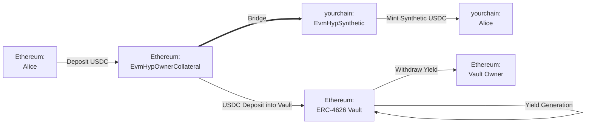
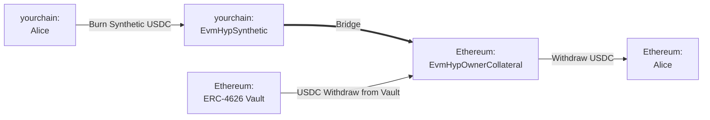

The goal of this guide is to illustrate how you can use Hyperlane Warp Routes (HWR) to create yield-generating bridges, ensuring idle bridged assets are productive by compounding yield over time. Depending on the variant (more details below), yields are distributed to the yield route owner or users.

<Note>
  **If you are a vault provider**, you only need to supply your ERC-4626 vault
  address on the origin chain. Hyperlane (or your integration partner) handles
  deploying and operating the route. Share this guide with the party doing the
  deployment and provide them with your vault address.
</Note>

## Concepts

- **ERC-4626 Vault**: The Ethereum standard for tokenized yield-bearing vaults. Upon deposit, share tokens are minted representing ownership of the underlying asset.
- **Yield Route (`EvmHypOwnerCollateral` & `EvmHypSynthetic`)**: The Hyperlane representation of a yield-bearing EVM collateral token. The yield route's vault's deposited asset address is used as the HWR's collateral token.
  - Two variants exist. In **owner-yield routes** (`EvmHypOwnerCollateral` & `EvmHypSynthetic`), vault yields go to the route owner. In **user-yield routes** (`EvmHypRebaseCollateral` & `EvmHypSyntheticRebase`), vault yields are passed through to holders by automatically increasing each holder's balance of the synthetic token. The underlying mechanics are otherwise the same.

## Pre-Requisites

To complete the following walkthrough, you should have the following available:

1. An origin and destination network of choice, between which you’d like to deploy the yield route.
2. An installed instance of the [Hyperlane CLI](https://docs.hyperlane.xyz/docs/reference/developer-tools/cli) and a wallet private key set as the `HYP_KEY` env var funded on your origin and destination networks.
3. The address of an [ERC-4626 vault](https://ethereum.org/en/developers/docs/standards/tokens/erc-4626/) on the origin network from which you want yield to be generated. This vault’s underlying asset will be set as the collateral for the HWR (e.g. if vault is USDC funded, the HWR will also support USDC transfer).
   <Warning>
     Your vault must implement the [ERC-4626
     standard](https://ethereum.org/en/developers/docs/standards/tokens/erc-4626/)
     without modifications to standard behavior. Vaults that charge a fee on
     deposit/withdrawal, use a rebasing underlying asset, or override standard
     share math may produce incorrect exchange rates or accounting errors. If
     unsure, verify that `previewDeposit`, `convertToAssets`, and
     `convertToShares` return values consistent with the standard before
     integrating.
   </Warning>

## Example Bridging Flow

The following walks through a yield route deployed between Ethereum (the origin chain, holding the ERC-4626 vault) and yourchain (the destination chain, where the synthetic is minted).

**Bridge USDC: Ethereum → yourchain**

In this example, Alice wants to bridge USDC between Ethereum and yourchain. The yield route will transfer her USDC to a yield-bearing ERC-4626 vault, and then mint her synthetic USDC on yourchain. Notice that the yield route owner can claim yields generated from that vault.

**Bridge USDC: yourchain → Ethereum**

When Alice wants to bridge back to Ethereum, the reverse happens. The yield route will burn her synthetic USDC, withdraw the USDC from the vault on Ethereum, and return her USDC.

## Yield Route Deployment Steps

Using the Hyperlane CLI, deploy a USDC EvmHypOwnerCollateral and EvmHypSynthetic tokens on Ethereum and yourchain, respectively:

**Step 1. Run `hyperlane warp init` to generate a HWR config:**

1.  Select `yourchain` and `Ethereum` using space, and hit enter.
2.  For Ethereum, select `collateralVault`, accept the mailbox, and enter the USDC vault address on Ethereum.
    - Alternatively, you can select `collateralVaultRebase` which is a yield route variant that distributes yields to users by increasing their holding amount.
3.  For yourchain, select `synthetic` and accept the mailbox.

    - If you selected `collateralVaultRebase`, you must pair it with a `syntheticRebase`

**Step 2. Run `hyperlane warp deploy` to deploy the HWR.**

## Claiming Yield

Depending on the yield route variant:

- **`collateralVault` (owner yield)**: Call `HypERC4626OwnerCollateral.sweep()` on the origin chain collateral contract. This sends all accrued yield to the contract owner address set at deployment. There is no fixed cadence — call it as often as desired.
- **`collateralVaultRebase` (user yield)**: Call `HypERC4626Collateral.rebase(destinationDomain)` on the origin chain collateral contract, where `destinationDomain` is the Hyperlane [domain ID](/docs/reference/domains) of the chain hosting the `syntheticRebase` contract. This sends an updated exchange rate to the synthetic contract on the destination chain, increasing all user balances proportionally.

<Check>
  🎉 Congrats! You have now created a new yield route with your vault. Bridged
  user assets can now earn passive yield while present in the origin HWR.
</Check>

<Warning>
  Please note that this collateralization strategy takes on certain ISM trust
  assumptions, and there is inherent risk that the underlying [ERC-4626
  vault](https://ethereum.org/en/developers/docs/standards/tokens/erc-4626/)
  becomes under-collateralized.
</Warning>

## More Resources

To learn more about yield routes and the underlying standards:

<CardGroup cols={3}>
  <Card
    title="Bridge a Token"
    icon="rocket"
    href="/docs/guides/quickstart/deploy-warp-route"
  >
    In-depth walkthrough of the underlying warp route deployment steps.
  </Card>
  <Card
    title="Introducing Yield Routes"
    icon="newspaper"
    href="https://medium.com/hyperlane/introducing-yield-routes-f7e8fd091443"
  >
    Post from Hyperlane Blog.
  </Card>
  <Card
    title="ERC-4626 Vault Standard"
    icon="file-lines"
    href="https://ethereum.org/en/developers/docs/standards/tokens/erc-4626/"
  >
    The tokenized vault standard yield routes are built on.
  </Card>
</CardGroup>
