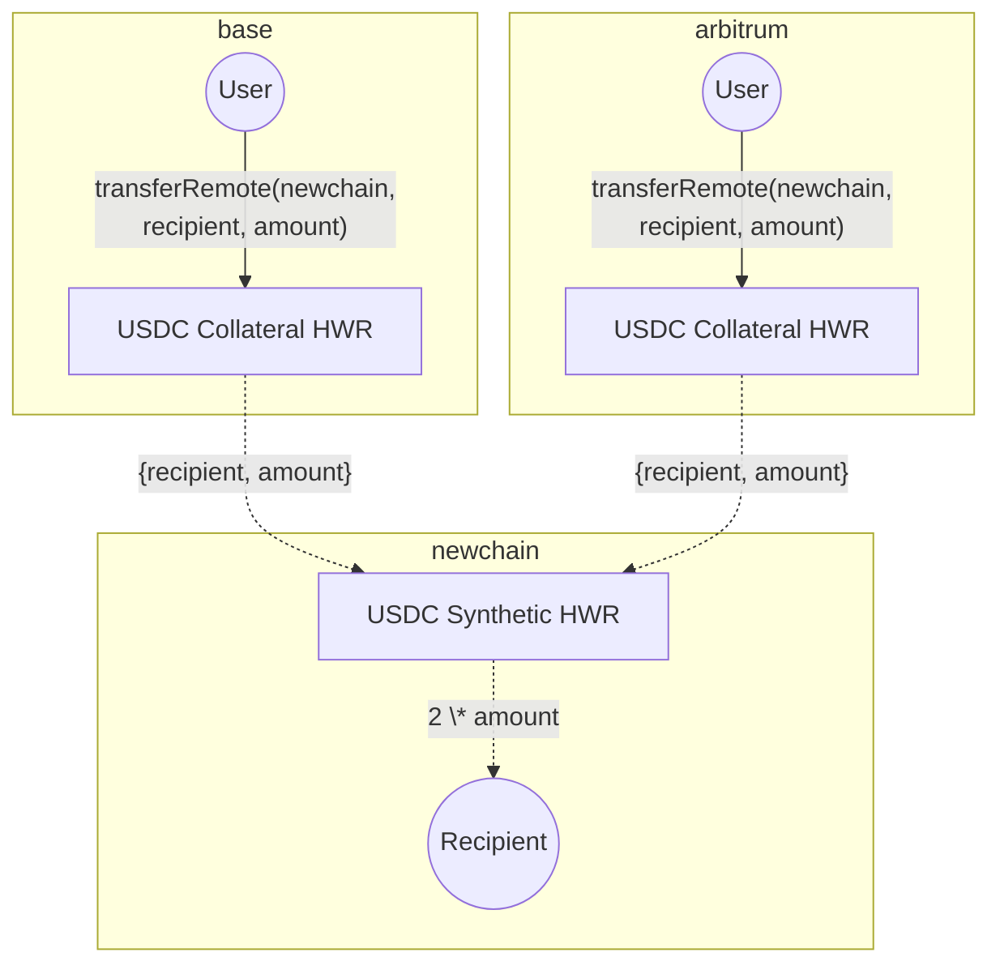
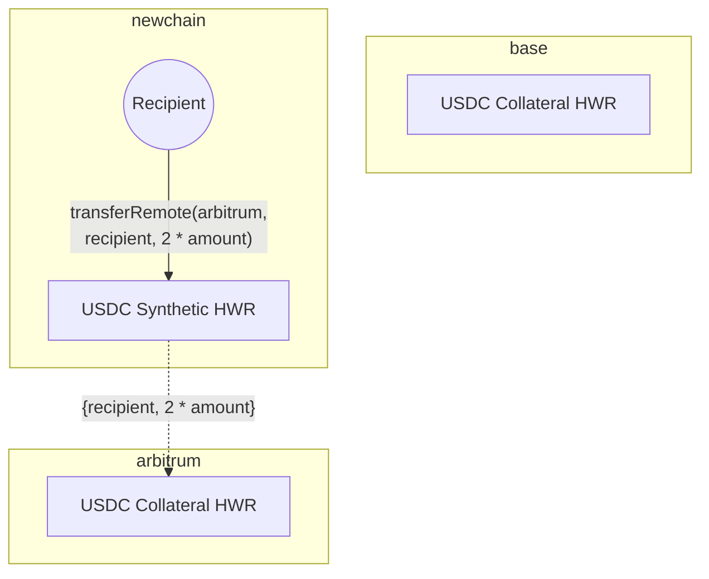
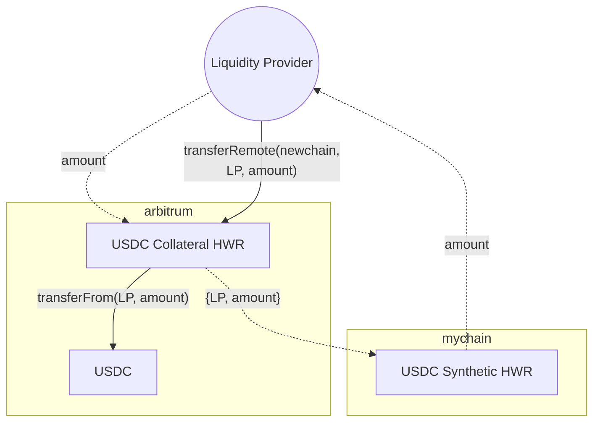
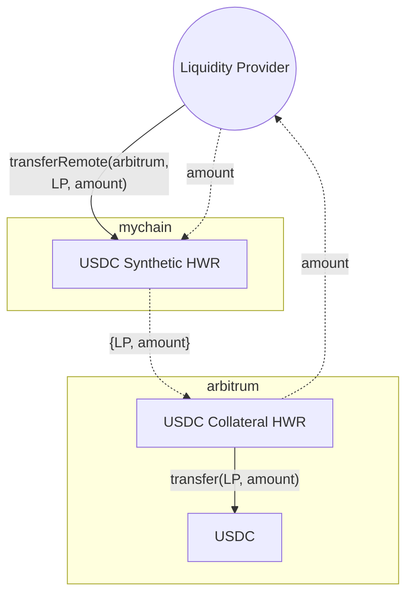

A **Hyperlane Warp Routes (HWR) 2.0** is a way to bridge multiple existing tokens across different chains while maintaining liquidity. Instead of introducing a new synthetic asset for every transfer, it allows chains to leverage existing token liquidity in a structured manner.

This is useful when expanding to new chains, ensuring users have access to assets that already exist in the ecosystem. The diagram below shows a setup where canonical USDC exists on Base and Arbitrum, with a synthetic HWR created on a new chain.



### Collateral Imbalances

If more funds flow in one direction, one of the chains in the route can run out of collateral. This _imbalanced flow_ prevents withdrawals until the collateral is covered.



To fix this and maintain a good user experience, we must perform _collateral rebalancing_; collateral may need to be moved between chains or sourced from local inventory to restore balance. An aligned actor may assume a traditional Liquidity Provider (LP) role and provide collateral to address these imbalances using their inventory.

## Liquidity Provider

Currently, Hyperlane Warp Routes 2.0 don’t have an explicit liquidity provider interface that enables local deposits/withdrawals. However, LPs can manually manage liquidity using the [Hyperlane CLI](https://www.npmjs.com/package/@hyperlane-xyz/cli) or the UI to interact with the HWRs in the [Hyperlane registry](https://github.com/hyperlane-xyz/hyperlane-registry).

<Warning>
  The stopgap procedure defined below requires at least one synthetic chain to
  exist within the HWR topology.
</Warning>

- To inspect a HWRs topology, use the `warp read` command:

```
hyperlane warp read --symbol ETH

ethereum:
    type: native
    ...
base:
    type: native
    ...
bsc:
    type: synthetic
    ...
```

- To send a transfer (`transferRemote`) on a HWR, use the `warp send` command:

```
hyperlane warp send \
	--symbol ETH \
	--origin base \
    --destination bsc \
	--amount <AMOUNT> \
	--recipient <ADDRESS>
```

### Depositing Liquidity

LPs can deposit collateral via a `transferRemote` where:

- `destination` domain is a chain where the HWRs has a `synthetic` type
- `recipient` address is controlled by the LP
- `amount` is liquidity denominated in the `origin` chains `collateral` token



This can be done by providing liquidity on many collateral chains and representing a claim on each collateral with a single synthetic asset balance.

### Withdrawing Liquidity

LPs can withdraw via a `transferRemote` where

- `destination` domain is a chain where the HWR is a `collateral` type
- `recipient` address is controlled by the LP
- `amount` is denominated in the `destination` chains `collateral` token


