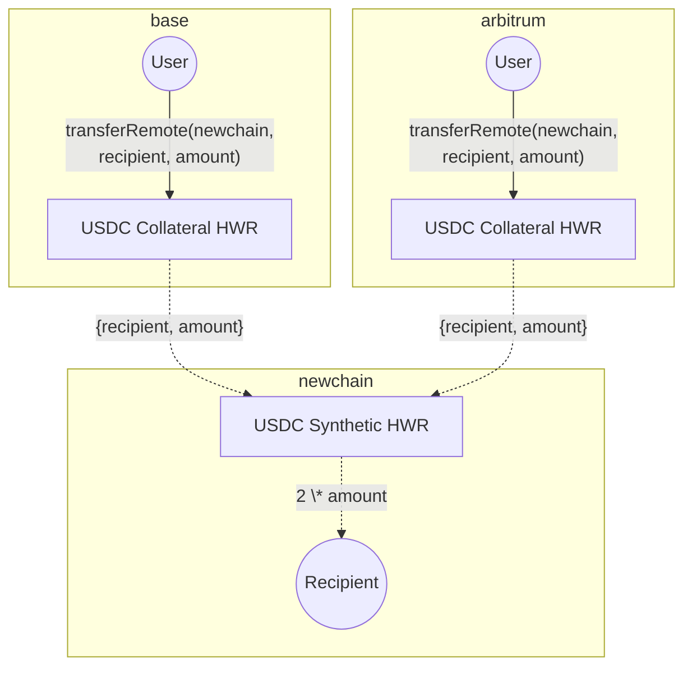
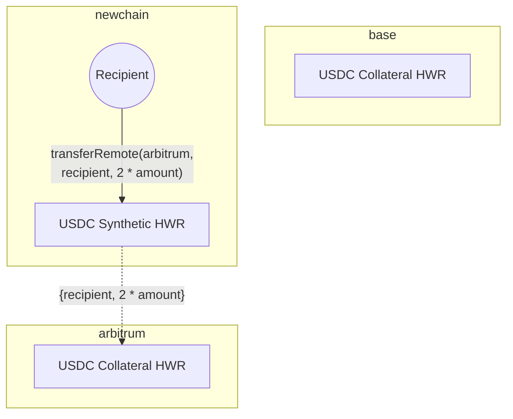
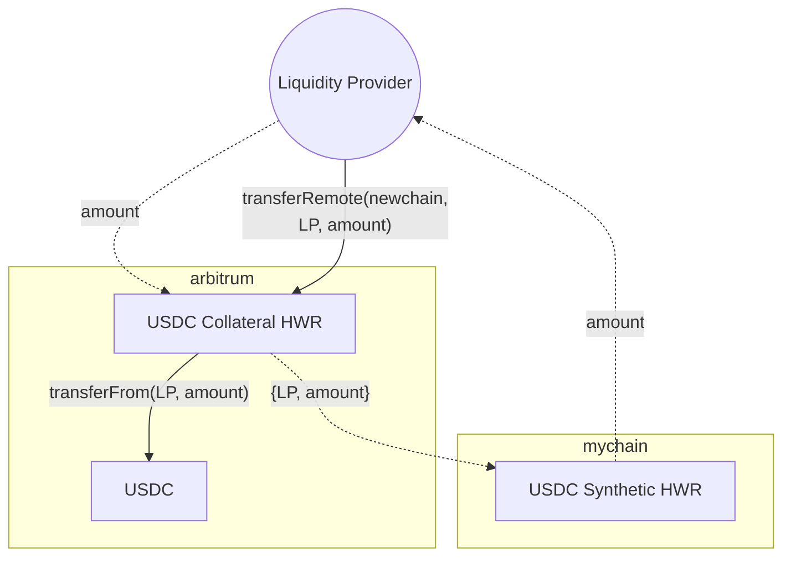
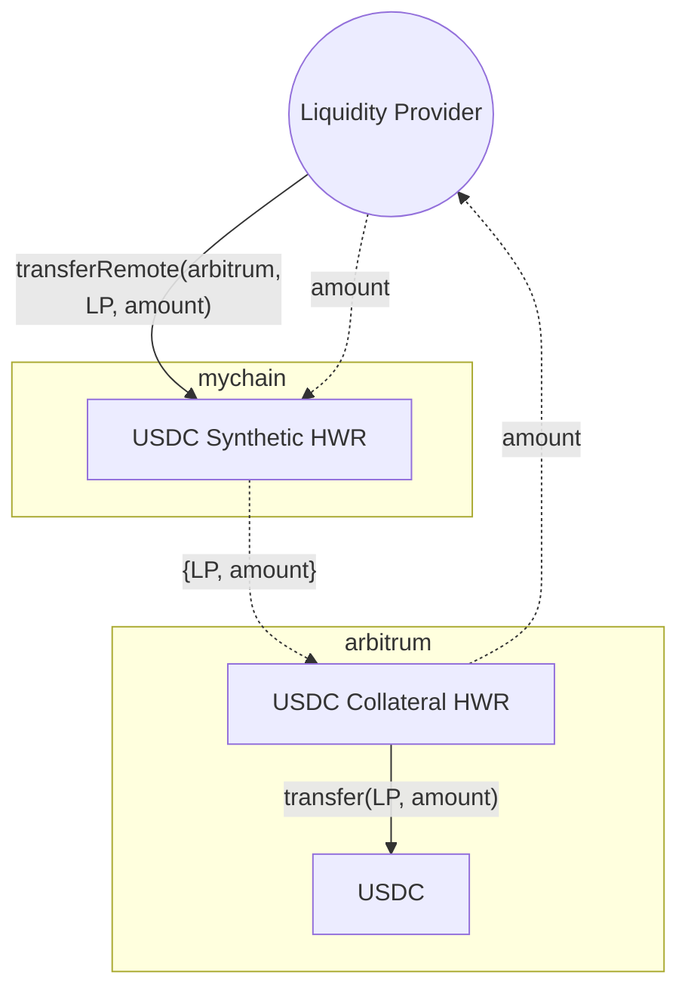

Chains want to allow users to deposit and withdraw tokens from multiple networks, as users increasingly hold assets across different chains and expect a seamless cross-chain experience. However, manually managing token liquidity across all these chains can be complex and operationally intensive.

**Hyperlane Warp Route (HWR) 2.0** eliminates the complexity of managing multi-chain token liquidity while enabling users to deposit tokens from any supported chain to the destination chain. Instead of manually rebalancing collateral across chains, HWR 2.0 automatically maintains liquidity where chains need it, when they need it.

## Liquidity Imbalances Challenges

When deploying assets (like USDC, USDT, ETH) across multiple chains as wrapped tokens, liquidity management becomes necessary.

Liquidity gets unbalanced when:

- Users deposit tokens on Chain A but withdraws from Chain B
- Chain B runs out of tokens
- New users cannot withdraw from Chain B until someone manually moves tokens from Chain A to Chain B

## The Solution: Native Rebalancing

HWR 2.0 solves the liquidity imbalance problem with a new **Rebalancer Agent** and smart contract support. The Warp Route contracts have been upgraded to enable the new functionality, with a rebalancer role which the contract owner controls.

### Rebalancer

HWR 2.0 includes a built-in **Rebalancer.** The Rebalancer is a whitelisted agent that continuously monitors and manages collateral across all chains in the warp route. This agent uses external/native bridges like CCTP or protocols like Everclear to automatically move funds between chains, maintaining optimal liquidity distribution.

For example, if users deposit USDC on Arbitrum and withdraw on Base, the Rebalancer can use CCTP to transfer USDC from Arbitrum to Base to maintain sufficient liquidity on Base.

### What Native Rebalancing enables

This enables:

- Deposits from any supported chain
- Withdrawals to any supported chain
- A seamless user experience

The rebalancer role can be operated by anyone the contract owner permits. Abacus Works offers this as a managed service, with rebalancing based on configurable thresholds and policies that determine when and how collateral should move.

## How it works

### Basic Setup

The diagram below shows a setup where canonical USDC exists on Base and Arbitrum, with a synthetic HWR created on a new chain.



### Collateral Imbalances

If more funds flow in one direction, one of the chains in the route can run out of collateral. This _imbalanced flow_ prevents withdrawals until the collateral is rebalanced.



### Managing Collateral Imbalances

To maintain a smooth user experience, collateral must be balanced across chains. HWR 2.0 introduces native rebalancing capabilities that automate this process where supported - collateral is automatically moved between chains to resolve imbalances. For deployments without native rebalancing, this requires manually moving collateral between chains.

### Requirements for Native Rebalancing

For native rebalancing, the following requirements must be met:

- A Rebalancer Agent (the whitelisted agent that monitors and manages collateral)
- Warp Route contracts with rebalancer role support
- Native/external bridges or protocols, typically available on major chains. For example, CCTP with USDC.

These components work together to create a complete native rebalancing system.

<Warning>
  Chains without native bridge support or external protocol integration cannot
  support this feature.
</Warning>

## Manual Rebalancing

<Note>
  This section is for advanced users managing liquidity manually. The automated
  rebalancer is recommended where available.
</Note>

### Liquidity Provider

Currently, Hyperlane Warp Routes 2.0 don’t have an explicit liquidity provider interface that enables local deposits/withdrawals. However, LPs can manually manage liquidity using the [Hyperlane CLI](https://www.npmjs.com/package/@hyperlane-xyz/cli) or the UI to interact with the HWRs in the [Hyperlane registry](https://github.com/hyperlane-xyz/hyperlane-registry).

<Warning>
  The stopgap procedure defined below requires at least one synthetic chain to
  exist within the HWR topology.
</Warning>

- To inspect a HWRs topology, use the `warp read` command:

```
hyperlane warp read --symbol ETH

ethereum:
    type: native
    ...
base:
    type: native
    ...
bsc:
    type: synthetic
    ...
```

- To send a transfer (`transferRemote`) on a HWR, use the `warp send` command:

```
hyperlane warp send \
	--symbol ETH \
	--origin base \
    --destination bsc \
	--amount <AMOUNT> \
	--recipient <ADDRESS>
```

### Depositing Liquidity

LPs can deposit collateral via a `transferRemote` where:

- `destination` domain is a chain where the HWRs has a `synthetic` type
- `recipient` address is controlled by the LP
- `amount` is liquidity denominated in the `origin` chains `collateral` token



This can be done by providing liquidity on many collateral chains and representing a claim on each collateral with a single synthetic asset balance.

### Withdrawing Liquidity

LPs can withdraw via a `transferRemote` where

- `destination` domain is a chain where the HWR is a `collateral` type
- `recipient` address is controlled by the LP
- `amount` is denominated in the `destination` chains `collateral` token


