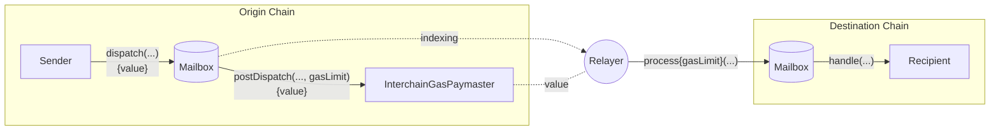
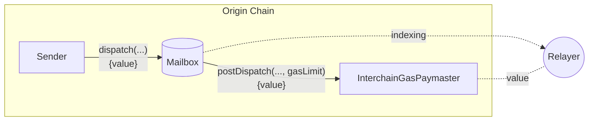
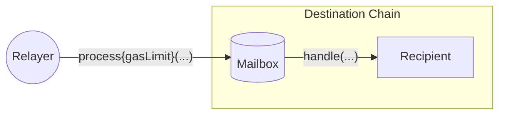

Successful interchain messages require two transactions; one on the origin chain to send the message, and one on the destination chain to deliver the message.

For convenience, Hyperlane provides an onchain interface on the origin chain that allows message senders to pay [fees](#interchain-gas-payment-calculation) to the [Relayer](/docs/protocol/agents/relayer) to deliver a message on the destination chain. This payment is called an **interchain gas payment**.

## Interchain Gas Payment Process

To [deliver a message](/docs/reference/messaging/send), a transaction must be included on the destination chain that calls the Mailbox `process` function with the encoded message and ISM metadata.

For convenience, a [Relayer](/docs/operate/relayer/run-relayer) watches for dispatched messages and will submit process transactions on behalf of the message sender if they receive sufficient payment on the origin chain. This is the _interchain gas payment_.

Because messages can trigger arbitrary code execution, the Relayer must meter the [`handle` call](/docs/reference/messaging/receive#handle) with a `gasLimit` to charge appropriately at message dispatch time.

## InterchainGasPaymasters

Interchain gas payments are facilitated by `InterchainGasPaymaster` (IGP) smart contracts.

These contracts expose the [InterchainGasPaymaster interface](/docs/reference/hooks/interchain-gas), which allow message senders to pay the Relayer with native tokens on the origin chain to cover the costs of delivering a message on the destination chain.

Each `InterchainGasPaymaster` contract corresponds to exactly one Relayer. You can find addresses of the Abacus Works' Relayer under [addresses](/docs/reference/addresses/deployments/mainnet/interchainGasPaymaster).

### Interchain Gas Payment Calculation

The interchain gas payment is calculated as follows:

$$
destinationTxCost = destinationGasPrice * gasLimit
$$

$$
exchangeRate = \frac{originGasTokenPrice}{destinationGasTokenPrice}
$$

$$
originFee = exchangeRate * destinationTxCost
$$

The `gasLimit` and the `exchangeRate` are configured by the message sender and the Relayer, respectively.

## Trust Assumptions

Interchain gas payments are based on a social contract between the message sender and Relayer. In other words, a Relayer may receive interchain gas payments without delivering the corresponding messages. Therefore, when making interchain gas payments, it is recommended to use an IGP contract that is associated with a known and reputable Relayer.

An honest Relayer implementation will honor any successful gas payments made to its IGP, no matter how many tokens were actually paid. By keeping [gas oracles](/docs/reference/hooks/interchain-gas) up to date, the Relayer can ensure that gas payments succeed if and only if a "fair" price was paid.

There are no trust assumptions with respect to Relayers in the Hyperlane protocol, and under no circumstances will a malicious Relayer be able to censor or falsify messages. The worst thing that a Relayer can do is accept payments without delivering a message.

## Learn More

- For details on gas limit calculations, benchmarking recommendations, gas oracles, and destination gas configuration, refer to [Interchain Gas Payment Details](/docs/reference/hooks/interchain-gas).
- For Relayer setups and implementation guidance, see the [Relayer](/docs/operate/relayer/run-relayer) section.
