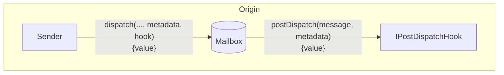
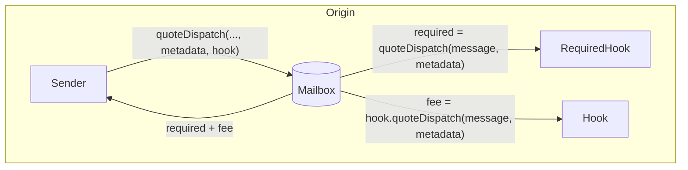
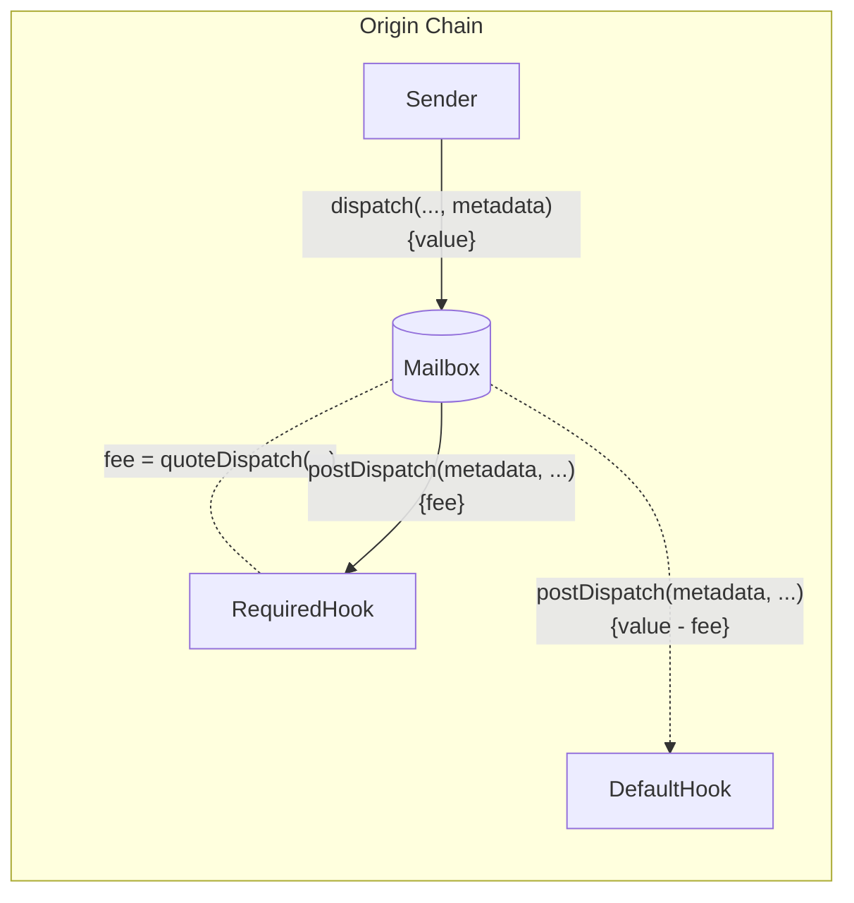

Post-dispatch hooks allow developers to configure additional origin chain behavior with message content dispatched via the Mailbox.



This allows developers to integrate third party/native bridges, make additional chain commitments, or require custom fees all while maintaining a consistent single-call Mailbox interface.

<Accordion title="`IPostDispatchHook` Interface">

<CodeGroup>

```solidity Solidity
// SPDX-License-Identifier: MIT OR Apache-2.0
pragma solidity >=0.8.0;

/*@@@@@@@       @@@@@@@@@
 @@@@@@@@@       @@@@@@@@@
  @@@@@@@@@       @@@@@@@@@
   @@@@@@@@@       @@@@@@@@@
    @@@@@@@@@@@@@@@@@@@@@@@@@
     @@@@@  HYPERLANE  @@@@@@@
    @@@@@@@@@@@@@@@@@@@@@@@@@
   @@@@@@@@@       @@@@@@@@@
  @@@@@@@@@       @@@@@@@@@
 @@@@@@@@@       @@@@@@@@@
@@@@@@@@@       @@@@@@@@*/

interface IPostDispatchHook {
    enum Types {
        UNUSED,
        ROUTING,
        AGGREGATION,
        MERKLE_TREE,
        INTERCHAIN_GAS_PAYMASTER,
        FALLBACK_ROUTING,
        ID_AUTH_ISM,
        PAUSABLE,
        PROTOCOL_FEE,
        LAYER_ZERO_V1,
        RATE_LIMITED,
        ARB_L2_TO_L1,
        OP_L2_TO_L1
    }

    /**
     * @notice Returns an enum that represents the type of hook
     */
    function hookType() external view returns (uint8);

    /**
     * @notice Returns whether the hook supports metadata
     * @param metadata metadata
     * @return Whether the hook supports metadata
     */
    function supportsMetadata(
        bytes calldata metadata
    ) external view returns (bool);

    /**
     * @notice Post action after a message is dispatched via the Mailbox
     * @param metadata The metadata required for the hook
     * @param message The message passed from the Mailbox.dispatch() call
     */
    function postDispatch(
        bytes calldata metadata,
        bytes calldata message
    ) external payable;

    /**
     * @notice Compute the payment required by the postDispatch call
     * @param metadata The metadata required for the hook
     * @param message The message passed from the Mailbox.dispatch() call
     * @return Quoted payment for the postDispatch call
     */
    function quoteDispatch(
        bytes calldata metadata,
        bytes calldata message
    ) external view returns (uint256);
}
```

</CodeGroup>

</Accordion>

## Post Dispatch

In addition to the `message` dispatched via the Mailbox, the `postDispatch` function receives a `metadata` parameter. The `metadata` parameter is passed from the `dispatch` call through the Mailbox unmodified. This allows developers to pass any context they wish through to the hook.

<CodeGroup>

```solidity Solidity
function postDispatch(
    bytes calldata metadata,
    bytes calldata message
) external payable;
```

</CodeGroup>

If the `postDispatch` function receives insufficient payment, it may revert.

<Note>
  Post-Dispatch Hooks may be replayable. Developers creating custom hooks should
  implement safe checks to prevent this behavior.
  [Here](https://github.com/hyperlane-xyz/hyperlane-monorepo/blob/b69bc23239ecfc8f8a6277bb0f9bc248cffea234/solidity/contracts/hooks/warp-route/RateLimitedHook.sol#L16)
  is an example implementation.
</Note>

### Quote Dispatch (Fees)

Fees are often charged in `postDispatch` to cover costs such as destination chain transaction submission and security provisioning. To receive a quote for a corresponding `postDispatch` call, you can query the `quoteDispatch` function.

<CodeGroup>

```solidity Solidity
function quoteDispatch(
    bytes calldata metadata,
    bytes calldata message
) external view returns (uint256);
```

</CodeGroup>

The Mailbox has a `quoteDispatch` function that returns the aggregate fee required for a `dispatch` call to be successful.



Move to implementing a hook guide [here.](/docs/protocol/ISM/custom-ISM)

### Overriding default Hook Metadata

To override the default metadata, there is a `dispatch` overload that takes an optional `metadata` parameter.

<Note>
  Hooks currently expect metadata to be formatted with the
  [`StandardHookMetadata`
  library](/docs/reference/developer-tools/libraries/hookmetadata).
</Note>

<CodeGroup>

```solidity Solidity
function dispatch(
    uint32 destinationDomain,
    bytes32 recipientAddress,
    bytes calldata body,
    bytes calldata defaultHookMetadata
) external payable returns (bytes32 messageId);
```

</CodeGroup>

The custom `metadata` will be passed to the required hook's `quoteDispatch` and `postDispatch` functions, before being passed to the default hook's `postDispatch` function.



#### Examples

<Note>
  Checkout the: [`StandardHookMetadata`
  Library](https://github.com/hyperlane-xyz/hyperlane-monorepo/blob/b69bc23239ecfc8f8a6277bb0f9bc248cffea234/solidity/contracts/hooks/libs/StandardHookMetadata.sol)
</Note>

<CodeGroup>

```solidity Solidity
// send message from originChain to destinationChain TestRecipient
IMailbox mailbox = IMailbox("mailboxAddress");
mailbox.dispatch{value: msg.value}(
  destinationDomain,
  "paddedRecipient", // Convert recipient address to padded bytes32 format
  bytes("messageBody"),
  StandardHookMetadata.overrideGasLimit(200000)
);
```

</CodeGroup>

### Custom hook and metadata

After implementing the above interfaces, you can override default hook along the hook metadata by using the overloaded `dispatch` call in our mailbox:

<CodeGroup>

```solidity Solidity
function dispatch(
    uint32 destinationDomain,
    bytes32 recipientAddress,
    bytes calldata body,
    bytes calldata customHookMetadata,
    IPostDispatchHook customHook
) external payable returns (bytes32 messageId);
```

</CodeGroup>

#### Examples

<CodeGroup>

```solidity Example
// send message from originChain to destinationChain TestRecipient
IMailbox mailbox = IMailbox("mailboxAddress");
IPostDispatchHook merkleTree = IPostDispatchHook("merkleTreeHookAddress");
mailbox.dispatch(
  destinationDomain,
  "paddedRecipient", // Convert recipient address to padded bytes32 format
  bytes("messageBody"),
  "0x", // empty metadata
  merkleTree
);
```

</CodeGroup>
