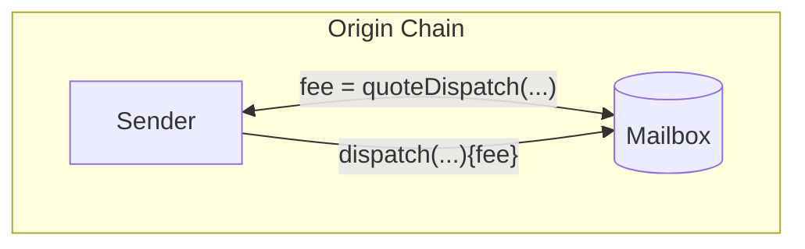
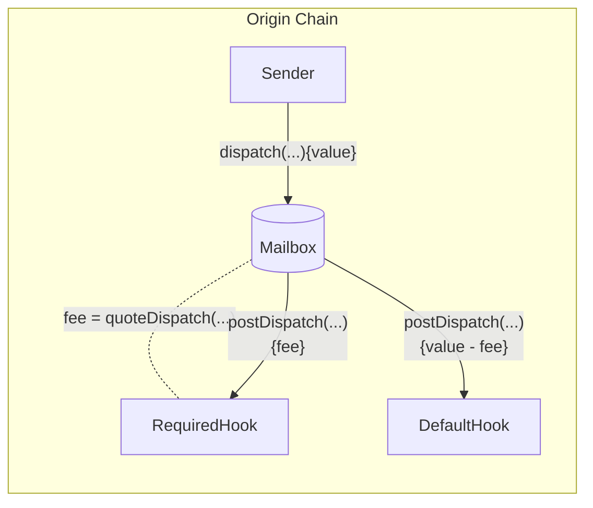

To send interchain messages, developers call `Mailbox.dispatch()`.

This function takes as parameters the message contents, the destination chain ID, and the recipient address. Each message gets inserted as a leaf into an [incremental merkle tree](https://medium.com/@josephdelong/ethereum-2-0-deposit-merkle-tree-13ec8404ca4f) stored by the `Mailbox`. Hyperlane's proof of stake protocol uses this merkle tree to verify fraud proofs.

## Dispatch

Calling this function dispatches a message to the destination domain and recipient.

<Warning>
  Hyperlane can only deliver messages to smart contracts that implement the
  `handle` function. See the [receive a message](./receive.mdx) documentation
  for more information.
</Warning>

Depending on the [post-`dispatch` hook configuration](#post-dispatch-hook-config), some payment may be required. See the [`quoteDispatch`](#quote-dispatch) section for more information.

### Solidity

```solidity
function dispatch(
    uint32 destinationDomain,
    bytes32 recipientAddress,
    bytes calldata messageBody
) external payable returns (bytes32 messageId);
```

<Info>
Recipient addresses are left-padded to `bytes32` for compatibility with virtual machines that are addressed differently. The following utility is provided in the [`TypeCasts` library](/docs/reference/developer-tools/libraries/typecasts.mdx) for convenience.

```solidity
function addressToBytes32(address _address) internal pure returns (bytes32) {
    return bytes32(uint256(uint160(_address)));
}
```

</Info>

### Examples

```solidity
// send message from Ethereum to Polygon TestRecipient
IMailbox mailbox = IMailbox("0xc005dc82818d67AF737725bD4bf75435d065D239");
bytes32 messageId = mailbox.dispatch{value: msg.value}(
  137,
  "0x000000000000000000000000f90cB82a76492614D07B82a7658917f3aC811Ac1",
  bytes("Hello World")
);
```

## Quote Dispatch

Fees are often configured to cover Interchain Gas Payments (IGP) as well as protocol costs. These include transaction submission on the destination chain, security provisioning, and maintenance. To receive a quote for a corresponding `dispatch` call, you can query the `quoteDispatch` function.



### Solidity

```solidity
function quoteDispatch(
    uint32 destinationDomain,
    bytes32 recipientAddress,
    bytes calldata messageBody
) external view returns (uint256 fee);
```

The quoted `fee` must be passed as value to the `dispatch` call to ensure it does not revert.

### Examples

```solidity
// quote sending message from Ethereum to Polygon TestRecipient
IMailbox mailbox = IMailbox("0xc005dc82818d67AF737725bD4bf75435d065D239");
uint32 destination = 137;
bytes32 recipient = "0x000000000000000000000000f90cB82a76492614D07B82a7658917f3aC811Ac1";
bytes memory body = bytes("Hello World");
uint256 fee = mailbox.quoteDispatch(destination, recipient, body);
mailbox.dispatch{value: fee}(destination, recipient, body);
```

<Warning>
  Underpayment to `dispatch` will revert. If you are composing hooks together,
  overpayment **may not be refunded** to the message sender.
</Warning>

## Post-Dispatch Hook Config

There are two hooks configured on a Mailbox

- `required`: invoked for all `dispatch` calls with value that covers the required fee
- `default`: invoked (unless overridden) with remaining value after `required` hook



### Required Hook

To query the required hook configuration, you can call the `requiredHook` function.

```solidity
function requiredHook() external view returns (IPostDispatchHook);
```

### Default Hook

To query the default hook configuration, you can call the `defaultHook` function.

```solidity
function defaultHook() external view returns (IPostDispatchHook);
```

To override the default hook with a custom hook in the `dispatch` call, see the [Hooks Reference](/docs/reference/hooks/interchain-gas).
